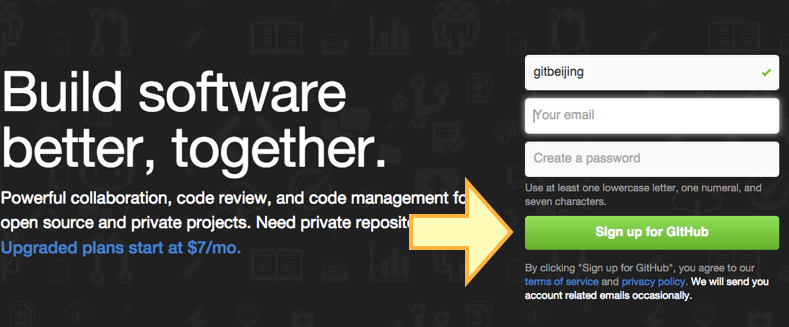

- 使用 web 界面直接操作 github
  - 没有命令行，不会 git 就不能用 github 吗?
  - web 界面可以放在讲 git 之前讲
  - 可以通过 web 的美观界面，让大家对仓库，历史，版本，patch ， commit ... 先有一个基本的概念
  - 为引出 git 的本地操作打下基础。
  因为最基础的 github 使用是只需要浏览器的，这样就可以浏览下载代码并且可以发简单的 PR 了
