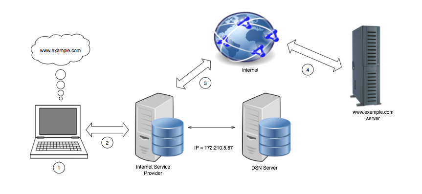
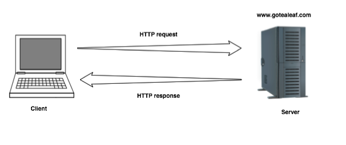
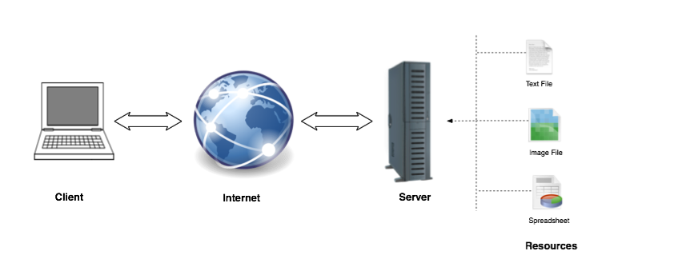

# 背景

### 概述和历史回顾
当你在浏览器地址栏输入 URL 的时候，你希望看到在你的浏览器里显示这个网站。当你点了一个链接，或者提交了一个表单，你的浏览器可能会显示下一个页面，或者在你的表单中显示一些错误提示，以便你能纠正它们并再次提交。你的浏览器就是一个接口，或者说一扇窗，通过她你就可以与万维网进行互动与交互。

在你的浏览器的背后，有一堆文件 -- CSS，HTML，Javascript，视频文件，图片文件等等 -- 这些文件构成了你所看到的页面。所有这些东西都是通过一个叫做 HTTP 的传输协议从**服务器**传输到你的浏览器，也就是**客户端**里（所以你现在知道为什么在浏览器地址栏输地址的时候前面加的是 `http://` 了吧）。

HTTP，或者超文本传输协议，是上世纪80年代由蒂姆.伯纳斯.李发明的。它是一个规则系统，是一种协议，把应用程序和超文本文档之间的传输联系起来。换句话说，HTTP 就是机器之间彼此沟通的一个协议，或者说一个消息格式。HTTP 遵循一个简单的模型：从客户端发出请求到服务器并等待响应。因此它也被认为是一种“请求--响应协议”。请求和响应都是文本信息，或者说是字符串，信息写法遵循着一个规则，能保证其他机器能够理解上面的内容。

HTTP 协议从创立之初已经经过了一些变化。最开始的时候这个协议仅仅返回 HTML 页面。在 1991年，第一个文档 HTTP/0.9 发布。1992年，HTTP/1.0 发布，并支持传输不同的文件类型，比如 CSS 文件，视频，脚本和图片。1995年，HTTP/1.1 介绍了连接复用和其他的一些特性。1999年又对 HTTP/1.1 做了一些改进，我们现在看到的就是这一版本。在撰写本文时，HTTP/2 正处于开发初期。

### 互联网是如何工作的
互联网是由数以百万计的互相连接的网络构成，网络中计算机和其他设备可以互相通信。按照惯例，网络内的所有设备都提供独特的标签。这种标签的总称是互联网协议地址或 IP 地址，是类似于在互联网上的计算机的电话号码。此外，IP 地址还有端口号，这会提供更多关于如何与其交流的细节 (类似于分机号码)。IP 地址一般都长这样：

```ruby
192.168.0.1
```

当需要一个端口号的时候，这样：

```ruby
192.168.0.2:1234
```

IP 地址是`192.168.0.2`，端口号是`1234`。
IP 地址是设备或服务器的标识符，可以包含数以千计的端口，每个端口都用于不同的交互目标。

互联网是比网络更大的一个概念，互联网上每个设备都有 [互联网服务供应商 (ISP)](http://en.wikipedia.org/wiki/Internet_service_provider) 提供的公网 IP 地址，通过这些地址，它们可以进行通信。当我们想访问 Google 的主页的时候，我们并没有在浏览器里输入它的 IP 地址，我们只是输入 Google 的 URL <http://www.google.com>，但是像 <http://www.google.com> 这样一个地址，你的电脑是怎么知道它的 IP 地址的呢？

### DNS

URL 和 IP 地址之间的对应由域名解析系统也就是常说的 DNS 来控制。DNS 是一个分布式数据库，把像 <http://www.google.com> 这样的域名翻译成 IP 地址，并将请求映射到远程服务器。换句话说，DNS 在互联网上记录 URL 和它对应的 IP 地址。所以像 <http://www.google.com> 这样的域名会被解析成一个 IP 地址 `197.251.230.45`。顺便提一下，通过在浏览器地址栏里敲 IP 地址也能访问网站。

不过，比起记一串数字来说，大多数人还是喜欢使用一个用户友好的地址如 <http://www.google.com> 这样的。DNS 数据库被安装在叫做 DNS 服务器的设备上。重要的一点是，DNS 服务器集群是分层级的，没有任何一个单一的 DNS 服务器中包含所有数据。如果一个 DNS 服务器里没有一个请求需要的域名，这个 DNS 服务器就会把请求转发给这个集群上更上一层节点的 DNS 服务器。最终，这个域名会在某个 DNS 服务器上的数据库里被发现，然后它对应的 IP 地址所代表的设备就会来接受这个请求。

你通过浏览器与互联网交互的一个典型实例是这样的：

1. 在浏览器里输入类似 <http://www.google.com> 这样的地址。
2. 你的请求被发送到你设备的网络接口。
3. 这个请求的互联网之旅从搜索 <http://www.google.com> 的 IP 地址开始。在屏幕后面，<http://www.google.com> 代表了一个与某个远程服务器关联的 IP 地址的人类友好的名称。
4. 远程服务器接受请求并将响应通过互联网发送到你的网络接口，并把它交给你的浏览器。
5. 最终，浏览器把这个响应作为一个网页的形式呈现在你面前。

有一点你要明白，当你的浏览器发出请求的时候，它只是发送了一些文本到一个 IP 地址。因为客户端 (浏览器) 和服务器 (请求接收者) 之间有一个 HTTP 形式的约定，或者叫协议，这样服务器才可以分析请求，了解其组成并将响应发送回 web 浏览器。然后，web 浏览器将响应字符串处理成你能理解的内容。浏览像 Facebook，Google 和 Twitter 这样的网站，就意味着你一直在使用 HTTP。这些细节都被隐藏了，你的浏览器会自动处理好请求和响应。互联网的不同部分看起来像是这样的：



### 客户端和服务器

最常见的客户端是你每天与之交互，被称为 Web 浏览器的应用程序。Web 浏览器常见的有 Internet Explorer、 火狐、 Safari，包括移动版本。Web 浏览器的职责是发送 HTTP 请求，并将响应处理成人类友好的形式显示在你的显示器上。web 浏览器并不是唯一的客户端，有很多工具或者应用都能发送 HTTP 请求。

你的请求的内容最终的接收者是被称为服务器的远程计算机。服务器也没啥神秘的，就是处理请求的设备，它们的工作就是发送一个响应回去。通常情况下，服务器发送回去的响应里面都包含了请求中指定的一些数据。



### 资源 (Resources)

资源是一个通用术语，指的是互联网上你通过 URL 与其交互的东西。包括了图片，视频，网页和其他文件。资源并不限于文件或者网页。资源也可能是一个软件，一个炒股的软件，一个游戏。互联网上有无数的资源。



### 无状态的 (statelessness)

当一个协议设计成每一个请求/响应周期与前一个都是互相独立的话，我们就说这个协议是无状态的。对于 HTTP 要知道的一点就是，无状态协议对于服务器资源和易用性的影响。HTTP 协议下，服务器不需要在各次请求之间保留状态信息。结果就是如果一次请求出了问题，系统不必做任何清理。以上两个原因让 HTTP 协议变的很灵活，但同时也变的很难构建有状态的应用。因为 HTTP 本质上是个无状态的互联网协议，这就意味着 web 开发人员在构建有状态应用的时候，不得不努力想办法来模拟 web 应用中的有状态体验。
举个例子，当你上 Facebook 的时候，你先登录，然后你看到了一个 Facebook 的网页。这就是一个完整的请求/响应周期。你点了一张照片 -- 另一个请求/响应周期 -- 但是在第二个动作之后你并没有退出登录。如果 HTTP 是无状态的，它是怎么维持状态并且知道你刚刚已经登录过了呢？事实上，如果 HTTP 是无状态的，Facebook 是怎么知道哪个请求是你发出的？它是怎么区分你和其他用户的？这些都是 web 开发人员和 web 开发框架耍的小诡计，让 web 应用看起来像是有状态的，不过这些小诡计不在本书的讨论范围内。你所要记住的就是，尽管你觉得这个应用是有状态的，但是在它背后，这个 web 应用是构建在 HTTP，一个无状态协议之上的。以上，就是为什么 web 如此灵活和去中心化，同时又特别难控制，也是为什么 web 的安全性难以保证，为什么在 web 上构建应用不是易事。

### 小结

本章用一种简单的描述解释了互联网如何工作和几个术语。你也学到了无状态对 web 应用的影响。在下一章，我们会深入探讨 <http://www.google.com> 这样的地址到底是什么以及它各部分的作用。
