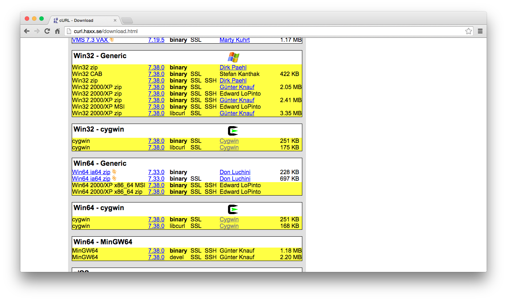
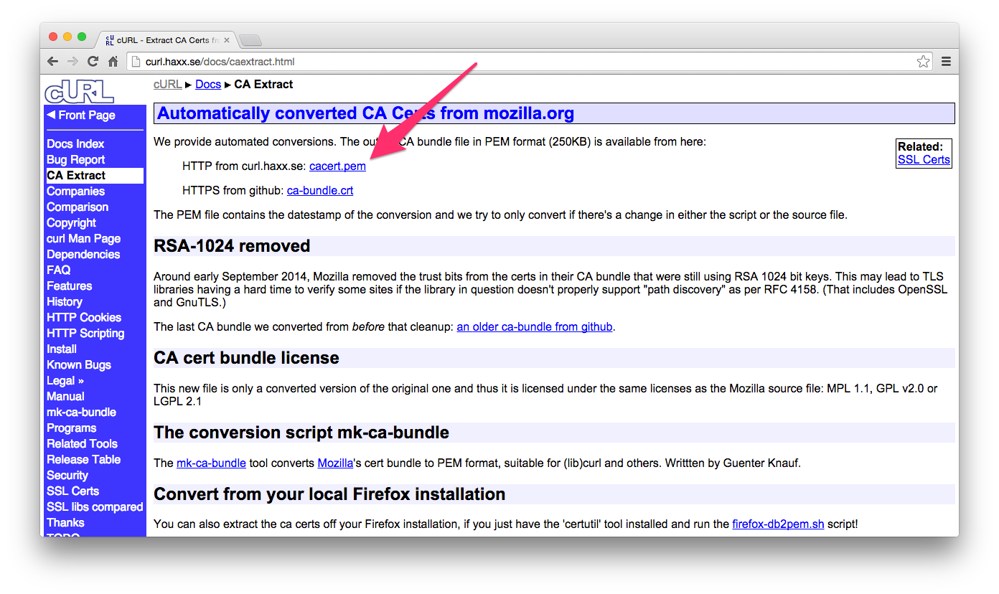
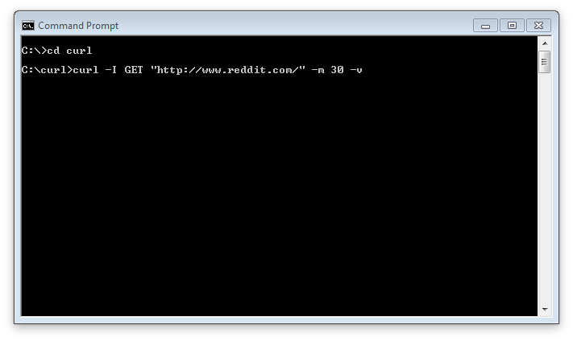

# 准备工作
对于 HTTP 的基础做了些概览之后，让我们来熟悉一下会在本书中用到，用于展示 HTTP 如何工作的工具。其实，阅读本书的时候，使用什么工具都无所谓，所以挑一个你用着顺手的就好。

### 浏览器插件
Google 的 Chrome 浏览器有几个插件你可以用，比如 [Postman](https://chrome.google.com/webstore/search/Postman?hl=en-US) 和 [REST HTTP API Client](https://chrome.google.com/webstore/detail/dhc-resthttp-api-client/aejoelaoggembcahagimdiliamlcdmfm)。

### HTTP GUI 工具
在本书中我们会经常使用图形化的 HTTP 工具。说到 HTTP 工具这个话题那能说的就太多了，所以长话短说，我们使用 [Paw2](http://luckymarmot.com/paw).虽然这是一个 Mac App Store 里的付费应用，不过它也有免费试用期，够你看这本书的时候用了。

尽管如此，还有很多其他备选方案。简单介绍几个很棒的吧: [HTTP Client](http://ditchnet.org/httpclient/)，[Fiddler](http://www.telerik.com/fiddler) 和 [Cocoa Rest Client](http://ditchnet.org/httpclient/)。

### HTTP 命令行工具

[curl](http://curl.haxx.se/) 是一个免费的命令行工具，经常被用于发送 HTTP 请求。

#### Mac OS X/Linux:
OS X 和大部分的 Linux 发行版应该都预装了 curl，你可以在命令行里非常方便的使用它，类似这样：

```ruby
$ curl www.usa.gov
```

#### Windows:

>#### 警告
>以下操作需要对 Windows 些底层工具比较熟悉。
>如果你在使用 Windows 并且对以下安装操作感到不适，强烈推荐你使用 GUI 工具，不论是浏览器插件还是安装到你系统上的软件都行。
>下面的操作不是必须的，跳过这些你也可以良好的阅读本书。

Windows 用户可以参照以下步骤安装```curl```:

1. 安装 [Visual C++ 2008 Redistributable Package](http://www.microsoft.com/en-us/download/details.aspx?id=15336)。
2. 安装 [Visual C++ 2010 Redistributable Package](http://www.microsoft.com/en-us/download/details.aspx?id=14632)。
3. 接下来安装 [OpenSSL](http://www.shininglightpro.com/products/Win32OpenSSL.html):
    * 32 位系统: Win32 OpenSSL v1.0.1j Light
    * 64 位系统: Win64 OpenSSL v1.0.1j Light
4. 现在去 curl 的 [主页](http://curl.haxx.se/) 并选择 [下载](http://curl.haxx.se/download.html)。
5. 在下载页面，找到 Windows 相关的地方，然后点击基于你自己系统的 binary SSL-enabled 版本进行下载:
下载这个文件，然后把```curl.exe```放到一个新的文件夹里。
6. 从 [这里](http://curl.haxx.se/docs/caextract.html) 安装一个 CA 证书.确保右键另存```cacert.pem```这个链接，并且把文件存成```.pem```格式的:
把这个证书拷贝到你刚才放```curl.exe```的文件夹里
7. 最后打开你的控制台，进入到你放```curl.exe```的文件夹然后跑下面这个命令: ```curl -I GET "http://www.reddit.com/" -m 30 -v```



可以的话，书中会展示用```curl```发起请求的命令，以帮助使用```curl```的读者。
