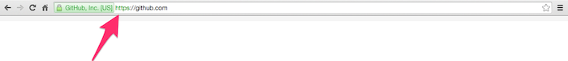
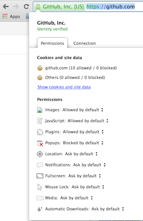
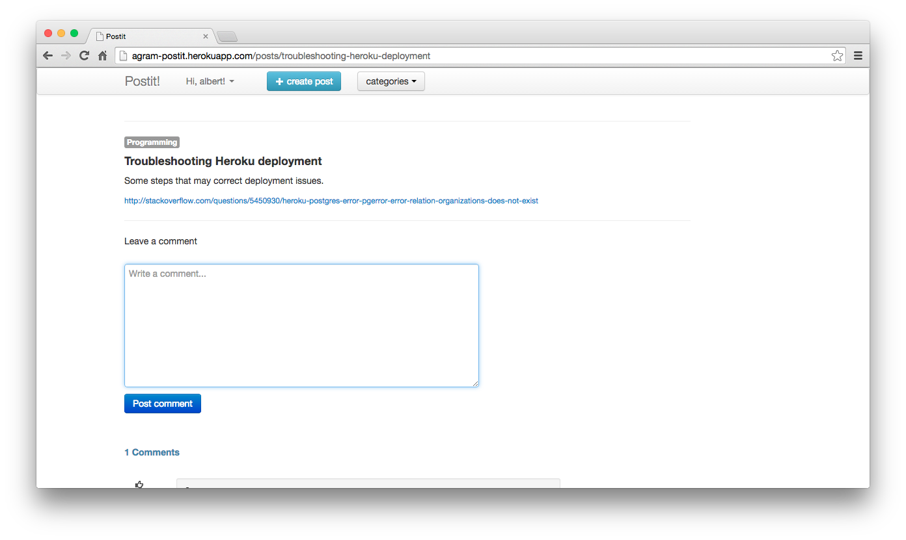
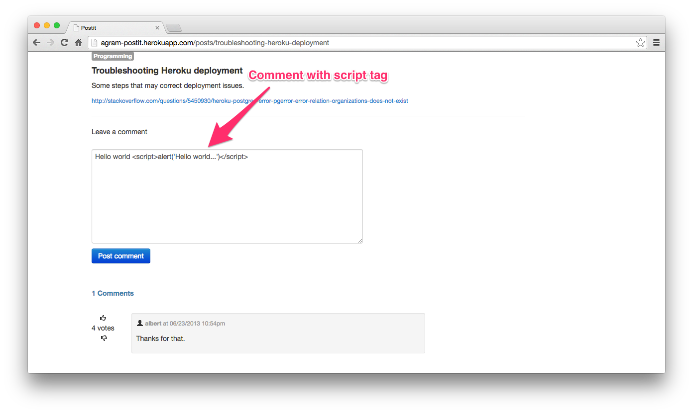

# 安全
正如我们在这本书中反复指出的， HTTP 的特性让它不容易被居心叵测的人控制，但是同样使得让 http 变得非常安全变得富于挑战性。现在你知道 Web 应用如何优雅的解决了 HTTP 无状态的问题，但是也可想而知还是有一些安全问题需要注意。举个例子，如果有人把我浏览器里的会话 id 偷走，他是不是就能用我身份登陆了？或者当我访问别的网站的时候，它们会不会窥视我 Reddit 和 Facebook 的 cookie 里存储的一些信息，比如会话 id ？本章我们就来讨论一下常见的 HTTP 安全问题。

### 安全的 HTTP（HTTPS）
在客户端和服务器互相发送请求和响应的时候，所有的请求和响应里的信息都是通过明文字符串发送的。如果一个恶意的黑客连接到同一网络，他就可以利用数据包嗅探技术来读取来回发送的消息。正如我们已知道的，请求可以包含会话 id ，它唯一地标识你到服务器之间的联系，所以如果别人复制了这个会话 id ，他们可以手动创建到服务器的请求，伪装成你的客户端，甚至都不需要你的用户名和密码就可以自动登陆。

这种情况就需要安全的 HTTP 也就是 HTTPS 来帮忙啦。通过 HTTPS 访问资源的时候，通常以 ```https://``` 开头而不是 ```http://``` ，而且通常在边上都会有个小锁子的图标： 

通过 HTTPS 发送的请求和响应在发送前都会被加密。这意味着如果一个恶意的黑客监听 HTTP 通信，他得到的信息都是加密的和无用的。HTTPS 通过一个叫做 [TLS](http://en.wikipedia.org/wiki/Transport_Layer_Security) 的加密协议来加密消息。在 TLS 开发完成前，早期 HTTPS 使用 ```SSL``` （ Secure Sockets Layer ）。这些加密协议在加密数据之前，需要先使用证书来与远程服务器进行通信来交换安全密钥。你可以点击 ```https://``` 前面那个小锁子的图标来查看这些证书： 

在与一个网站进行交互之前，大多数现代浏览器都会替你对网站的证书做一些检查，但是有时候自己手动查看一下证书也可以作为一个额外的安全保障。

### 同源策略（ Same-origin policy ）
同源策略是一个重要的概念，它允许来自同一站点的资源进行互相访问而不受限制，但是会阻止其他不同站点对文档/资源的访问。换句话说它可以阻止另一个站点通过脚本来操纵本站点的文档。同源的文档必须有相同的协议，主机名和端口号。举个例子，```http://www.test.com/aboutus.html``` 上的 HTML 文档可以嵌入 ```http://www.test.com/fancy.js``` 这个 javascript 文件，因为它们是同源的，有相同的协议，主机名和端口号(默认的 80) 。

反过来说，这就意味着 ```http://www.test.com``` 上的文档不能嵌入 ```http://www.example.com``` 上的文档，因为它们不是同源的。

>同源策略涉及的是访问文件内容，而不是链接，你可以随意链接到任何 URL。

虽然这样很安全，但是有时 web 开发人员需要进行跨域的内容访问就会很麻烦，所以就有了跨域资源共享技术 CORS 。 CORS 是一种机制，允许我们绕过同源策略，从一个域名向另一个域名的资源发起请求。CORS 的原理是添加新的 HTTP 头部，来对一些域名授权，那这些域名就可以发起对本页面资源的请求。

同源策略是防范会话劫持（见下一节）的重要手段，并作为 web 应用安全的基石。下面让我们来看一些 HTTP 的安全威胁和其对应的防范措施。

### 会话劫持（ Session Hijacking ）
我们已经知道，会话在维持 HTTP 的状态上扮演着重要的角色。我们也知道会话 id 作为一个唯一的令牌来唯一标识一个会话。通常，会话 id 是作为 cookie 存储在计算机上的一个随机字符串. 会话 id 随着每一个到服务器的请求被送往服务器用于唯一标识这个会话。事实上，这也就是很多 web 应用的用户认证系统所在做的事情，当用户的用户名和密码匹配之后，会话 id 会存储在用户的浏览器里，这样他们的下一个请求就不用重新认证了。

不幸的是，如果一个攻击者拿到了这个会话 id ，他就会跟用户共享这一个会话，同时也就能访问这个 web 应用了。在会话劫持攻击中，用户根本意识不到一个攻击者甚至不用知道她的用户名和密码就可以访问她的会话了。

#### 会话劫持的对策

* 一个比较流行的会话劫持防范措施是重置会话。也就是对于一个用户认证系统来说，一次成功的登录包括验证旧的会话 id 和生成一个新的会话 id 。完成此步骤后，在下一个请求里，会要求受害者进行身份验证。然后会话 id 就会改变，这样攻击者就无法访问到这个会话了。很多网站都采取这种办法，当用户在进行敏感操作的时候保证用户身份的正确性，比如给信用卡充值或者删除账户的时候。
* 另一个很有用的方法是给会话设置过期时间。那些不会过期的会话给了攻击者太多的时间去伪装成一个合法用户。如果设置了过期时间，比如 30 分钟，这样一来攻击者就不会那么从容的进行攻击了。
* 最后，其实我们已经讲过了，另一个办法就是整站使用 HTTPS 把攻击者能得到会话 id 的可能性降至最低。

### 跨站脚本攻击 (XSS)
我们最后要讨论的这个安全问题，对所有 web 开发者来说都很重要，叫做跨站脚本攻击或者 **XSS** 。当你允许用户输入的 HTML 和 javascript 在你自己的网站上直接显示的时候，就有可能遭受这种攻击。

举个例子，下面这个表格允许你输入评论，然后把评论直接显示在网页上:

因为这是一个普通的 HTML 文本框，所以用户可以在里面输入任何东西。也就意味着用户可以直接输入原始的 HTML 和 javascript 代码，并把它提交给服务器：


如果服务器端对于用户的输入不做任何无害处理的话，这些内容就会注入到网页的内容中去，然后浏览器就会解释执行这些 HTML 和 javascript 代码。在本例中会弹出一个警告框，这当然不是我们想要的结果。恶意用户可以使用 HTML 和 javascript 代码对服务器或者以后访问这个页面的用户发起毁灭性的攻击。举个例子，一个攻击者可以使用 javascript 代码去获取所有在他之后访问这个页面的用户的会话 id ，然后伪装成其他用户。而这一切都发生在受害者一无所知的情况下。而且要注意的是，这种攻击也能绕过同源策略，因为这段恶意代码是存在于当前这个网站上的。

#### 跨站脚本攻击的解决方案

* 阻止此类攻击的一个办法就是总是对用户输入的内容做无害处理。消除有问题的输入，比如```<script>```标签，或者使用一个更安全的输入格式，比如 Markdown，这样就可以阻止 HTML 和 javascript 同时出现在用户的输入里。
* 第二个办法就是在显示之前转义用户输入的所有数据.如果你需要用户能够输入 HTML 和 javascript 代码，那么当你显示这些输入内容的时候要确保它们被正确转义，这样浏览器就不会把它们当做代码给执行了。

### 小结
本章，我们讨论了 web 应用关于安全的诸多方面。不消说，这是一个宽泛的话题，我们只是蜻蜓点水一般掠过几个常见问题而已。本章的主要目的是展示一下在 HTTP 之上开发出的 web 应用是多么的脆弱，和确保一个 web 应用的安全性是多么的困难。
