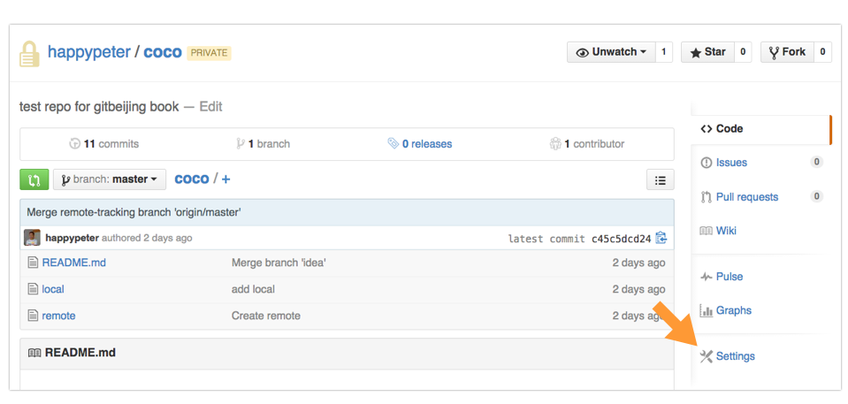
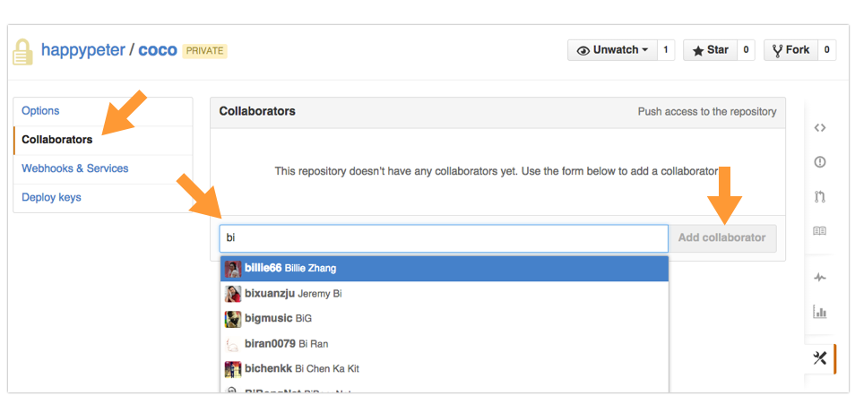
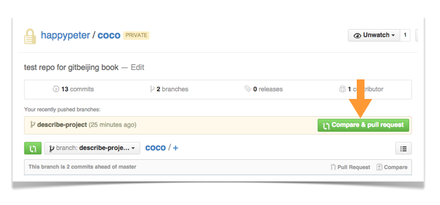
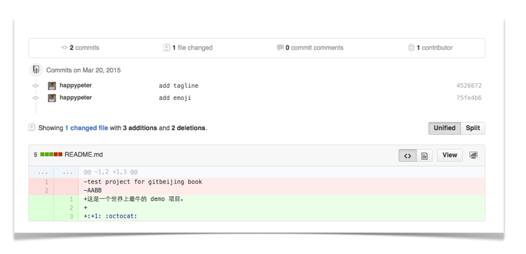

前几天还都是一个开发者唱独角戏。但是尽管如此也可以看出 git 带来的便利了，比如代码写错了可以回滚，为了新功能开发可以开新分支等等。但是 git 和 github 更大的威力在于协作。

聊了这门多天的 github，有必要稍微停下来，再想想究竟什么是 github 。没错，前面的使用中也看到了，github 是 git 仓库的托管平台，让我们的项目仓库可以方便的备份同步。但是其实也许比这个还要重要的是，github 是一个大家一起协作做项目的平台。

在 [How Github Use Github To Build Github](https://www.youtube.com/watch?v=qyz3jkOBbQY) 的演讲中，Zach Holman 说，

>多年来我一直在寻找做软件正确的方式，现在我想我找到了，github 就是这种方式。

这里说的方式，主要就是开发的流程，跟他人合作的方式。究竟 Github 是什么的问题从它的标语中也可以看出

Github 多年来总结出来一套自己的团队协作流程，简单而且强大，叫做[Github Flow](https://guides.github.com/introduction/flow/index.html) ，网站上的各个功能都围绕着这个流程来开发。另，中文版的 Github Flow 在[这里](http://gitbeijing.com/flow/) 。

要了解一个流程，没有什么比跑一个最简单的实际例子更好的方式了，官方给出的[Hello World](https://guides.github.com/activities/hello-world/)就是服务于这个目的，不过这个 Hello World 用的是纯粹的网页来实现整个流程。咱们今天用网页配合 Github For Mac 客户端来完成这个流程。

### 什么是 Github Flow ？

说白了，就是给一个项目开发新功能要走的几步。

第一步，创建新的话题分支。这个就是为了防止 master 分支上的代码被污染，如下图所示

第二步，不断实现功能，做成一个个新版本。

第三步，发起”拉取请求“（ Pull Request ）。

第四步，大家讨论。这是一个代码审核的过程。

最后，把话题分支的内容合并到 master 。

下面跑一个实际例子。

<!-- http://git-scm.com/book/en/v2/GitHub-Contributing-to-a-Project 的例子就挺好 -->

### 给队友添加写权限

现在我和 @billi66 要合作开发一个新项目。于是我就来创建这个项目，过程在[浏览器中使用 Github](github_in_browser.html)中已经介绍过了。下面就继续在 coco 这个项目上做演示。

现在我要把 @billi66 添加进来，让她也具有项目的各种操作权限，最终要的当然是修改的权限了。如何来做呢？把她添加成项目的 collaborator 就行了。 coco 本身是一个 Private Repo ，但是对于开源项目也是一样可以添加 collaborator 的。

<!-- 未来跟 scoot 一样，用一个开源的项目放在那里，大家看看，挺好 -->

首先到项目页面，点击 Settings 一项，

到项目的 Settings 页面，可以看到如下图所示的 collaborator 选项，输入框中输入 `bi` 就可以自动补齐出 `billie66` 了

回车选中，然后点 `Add collaborator` 按钮，这样就完成了。

### 开话题分支并在上面开发

现在我和 @billie66 都对 coco 项目有写权限，对于非常有把握的代码，可以直接在本地 master 开发然后 sync 到远端 master 分支上面。但是如果是比较重要的功能，还是要发单独开 Topic Branch 话题分支，这个是后面发 PR 的前提。

尽管所有的流程操作都可以在[浏览器中完成](https://github.com/blog/1557-github-flow-in-the-browser)。但是更为常见的情形是我和 @billie 会把代码 clone 到本地开进行新功能的开发，因为这样可以使用自己的编辑器以及测试工具。

现在我要对项目开发一个很大很大的功能，所以就先来开一个分支叫做 describe-project 。名字是越表意清楚越好的，这样队友比较能一眼看出我在干什么。注意开新分支一定要在刚刚更新过的 master 的基础上开。开好之后把这个分支发布到远端，以后这个分支上没实现一点小功能就 publish 到远端，这样的好处是队友可以随时看到我的进展。这部分的操作前面[客户端使用](github_for_mac.html)中都介绍了。

这样我做了两个版本，而且都同步到远端仓库了。所以到 describe-project 分支的历史上可以看到多了下面两个新 commit 。

这样我认为功能实现了，就可以发 PR 了。

### 发 Pull Request

PR 在整个流程中起着核心位置。其实 PR 的目的就是讨论，跟一般的讨论不同的地方在于整个讨论过程是围绕着实打实的代码。

先到仓库页面，找到发 PR 的大绿按钮

注意要进行对比的是哪两个分支，下面我要填写一些内容，说说我的 PR 的好处

在下方还可以看到这次 PR 的具体对比出来的代码内容

点击 `Create Pull Request` 按钮，这样发 PR 就成功了。@billie66 可以收到通知了。

补充一句。实际上，[客户端中也可以发 PR](https://github.com/blog/1946-create-pull-requests-with-github-for-mac)，达成的效果跟网页中发是一样的。

### 讨论审核代码

PR 的讨论过程也算是代码审核。不一定是一个老大审核小弟们的代码，可以是队友之间的互相审核。

@billie66 看到这个 PR 之后，就会发表她的意见了。

看到之后我觉得有道理，代码需要调整，那我现在是不是要撤销这 PR 重新发呢？不用。我只需要继续在 describe-project 分支上改代码然后再同步上来。

上面的图中可以看到，讨论不断继续，会形成一条由评论和代码穿插而成的一条线。最后达成一致，我或者 @billie 都可以点一下上面的大大的 `Merge Pull Request` 的按钮，这样 Topic Branch 上的代码就合并到 master 之上了。接下来 describe-project 这个分支也就可以删掉了。

每一个 PR 都是开发历史上的一次小事件，很长事件过去之后，再看看当时的 PR 就可以看到当时为什么要开发这个功能，大家都是什么意见，都写了哪些代码。所以是项目发展的珍贵资料。从这个角度来说，即使一个 PR 没有被 merge 进 master ，那它里面的代码和讨论的内容也会是非常有意义的尝试，也可能在未来会有很大的参考价值。

### 快速 PR

走一遍 Github Flow 其实方式并不唯一。前面讨论的，在自己的机器上改代码，用客户端作 commit，然后在网页上发 PR 是一种常见的方式。

如果我只是改一个文件中的一个小地方，完全可以使用 github 网页功能提供的[快速 PR](https://github.com/blog/1945-quick-pull-requests)这种方法。来演示一下。

网页界面中，找到我要修改的文件，点击 `edit`

然后在下面的界面中，可以直接填写一个 Topic 分支名，创建这个分支，并 commit 到这个分支上发 PR 了

说实话，即使是老手，你让我切换到编辑器和客户端，再跑一遍整个的这个发 PR 的流程，我也会觉得挺麻烦挺分心的。快速 PR 方法真的是非常方便。

### 总结
Github Flow 在本地的相关操作也可以用命令行来实现，会有更多的技巧可以使用，另外即使在网页上，PR 整个流程中也有很多很方便功能咱们还没有介绍到。更多内容可以参考 <http://git-scm.com/book/en/v2/GitHub-Contributing-to-a-Project> 。