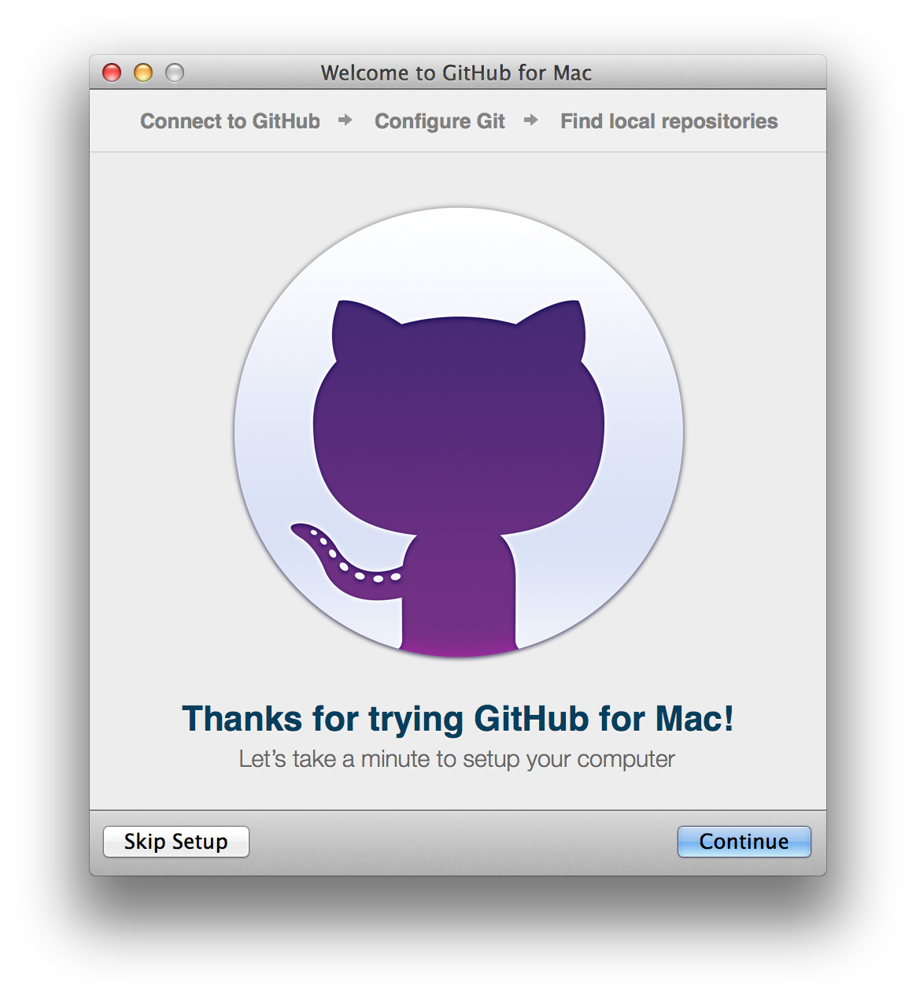
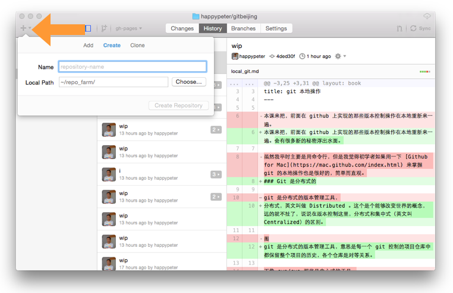
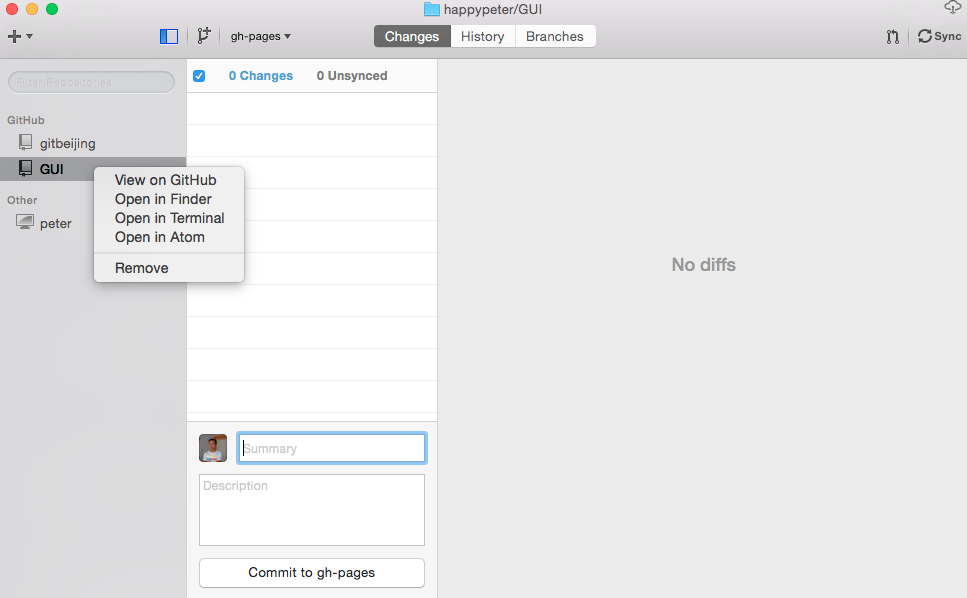
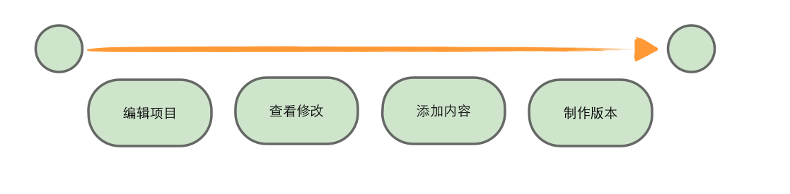
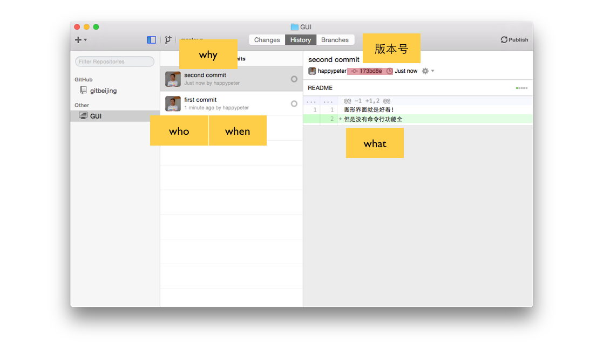
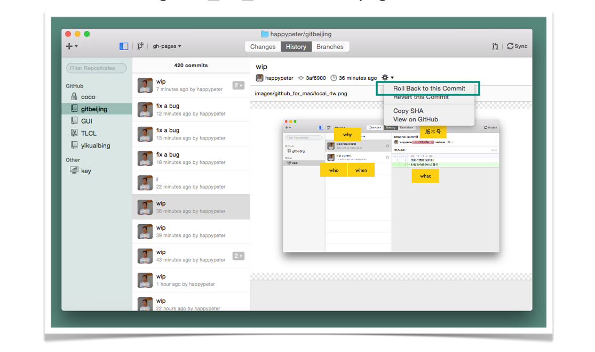
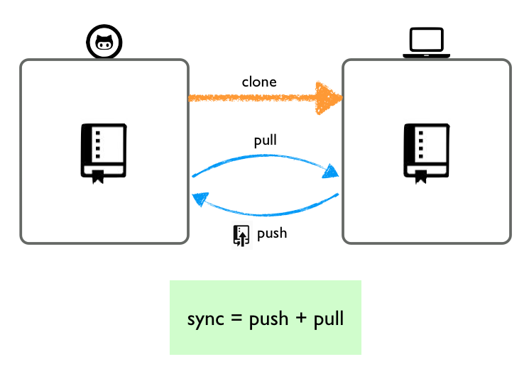

Git 是一个分布式的版本控制工具，即使我不联网，也可以在本地进行 git 的版本控制操作。
今天来把前面在 github 上实现的那些版本控制操作在本地重新来一遍。  会有很多新的秘密浮出水面。虽然是本地操作，依然不需要自己安装 git，今天的主角是 Github 公司制作的客户端，我下面用 Mac 版的演示，但是 Windows 客户端，[Github for Windows](https://windows.github.com/)，的操作也是类似的。

### 登录

先说说什么是 git 。git 是一套命令行工具，由下面这些“子命令”组成。

虽然最常用的只不过是其中很小的一部分，但是要学会命令行中使用 git 还是有一定难度的，一来是命令行 shell 本身的操作可能很多朋友就不熟悉。另外，即使对熟悉命令行的朋友，直接上手 git 也会因为一下子暴露在很多版本控制的新概念中而感到非常陡峭的学习曲线。所以命令行操作咱们往后放一放。今天一起来用图形化的客户端工具 [Github for Mac](https://mac.github.com/index.html)，它里面封装了 git，操作上更为美观，固化了一些操作流程，避免了新手一上来就被太多新概念轰炸。

git 的最核心的操作在客户端里都有，满足基本日常使用也就够了。

Github For Mac 客户端的安装跟其他 Mac 下的软件没有区别，很简单，不说了。启动之后要做的第一步就是用 Github.com 上我的账号来登录客户端。之后，如果网络是通的，就可以自动导入各种我在 github.com 上的信息。

### 添加仓库

往客户端里面添加项目仓库有三种方式。点击上图箭头所指的 `+` 号，就可以看到了，也就是下面图中的 `Add`，`Create`，`Clone` 这三种形式。

可以说这三种形式主要是被添加的仓库来源不同。先说第一种 `Add`，来源是你本地机器上已经存在的项目，填写它的文件夹位置，然后点击 `Create&Add Repository`，如果这个项目本身就是一个 git 仓库了，就直接添加进来，如果不是，就把它变成一个 git 仓库（其实也就是在项目内创建一个 .git 文件夹）然后再添加进客户端。

第二种，create ，就是自己新建项目。填写项目名，这里就叫 GUI 吧，选择项目存放位置，然后点 `Create Repository` 按钮，仓库就创建好了。这个操作似曾相识吧？跟前面在网站上的创建新仓库是类似的。

第三项，就是从 Github.com 上往本地 clone 。前面我已经用自己的 github 账号登录客户端了，会自动导入 github 上我自己的或者是一些相关的项目进来，选中一个，在本地硬盘上找一个位置存放起来就好了。

要删除一个仓库，就到下图左侧列表的项目名字上，右击，然后点 `Remove` 就行了。简单说说另外几项，[Atom](https://atom.io/) 是 github 公司开发的开源免费的代码编辑器，`Terminal` 是命令行终端，`Finder` 是文件浏览器。

现在我本地机器上有了项目仓库，下面就可以用任何我喜欢的编辑器来开发项目了。

### 基本版本控制

来修改一下项目。在 GUI 这个仓库中，创建一个 README 文件，里面随便写点内容。之后，到项目的 `Changes` 一项下面，就可以看到：

首先图中1和2两处可以看到目前项目修改了什么内容。同时可以看到1处是可以勾选的，也就是如果我一次修改了多个文件，可以只把其中的一部分文件勾选上，添加到下一个版本（ commit  ）之中。更为细致的，你可以到右侧的显示修改内容的区域，选择一部分内容添加到下个版本中。默认行号背景是蓝色的，表示内容被选中了。单击行号可以取消选中。3处要填写版本留言（ commit message ） ，先用一行内容说说为啥要做这次修改，下面的大框框里可以写详细的留言，是可选项。最后点击 `Commit to master` （ 把新版本做到 master 分支上 ）按钮，一个版本就保存好了。master 是默认分支的名字，后面讲分支的时候会细聊。

所以总结起来，从一个 commit 到下一个 commit，也就是从历史上的一个节点到下一个节点，要经历的操作是下面四步：

重复以上四步，再作一个版本出来。这样到客户端的 `History` 一项下面，就可以看到历史线上已经有两个 commit 了，点开任意一个都可以看到4个w，这个前面已经介绍了。

你可能会问，这里版本号（ commit id ）怎么是7位呢？其实，commit id 没有例外的都是40位，但是 git 的特点是，真正要用版本号的时候取前几位就行，只要跟其他 commit 区分开就可以。图中给出了前7位，已经是非常安全了。

在 github.com 上也经常会用到缩写的版本号。并且如果打开一个 commit，把地址栏链接中的版本号删除下图红色覆盖的部分，重新加载，也一样可以显示的。

### 回滚历史
回滚历史操作相当于后悔药。

既然历史版本都已经保存了，那么我要时空穿梭，回到任何一个版本的状态应该也是可以的。比如我刚刚做了一个版本，就发现修改的内容有问题，想要修改一下这个版本。可以到 `Changes` 选项下，点击页面最底端的 `undo` 标签。

注意，如上图，undo 操作是对 `Unsynced` 的版本有效，如果版本已经同步到远端，队友已经都看见了你的这个版本，并且可能已经在这个版本的基础上继续开发了，那么直接删除版本会给协作带来麻烦。

当然，对于已经同步到远端仓库的版本，也可以用另外的方式来撤销修改内容。到 `History` 标签下，打开任何一个 commit ，都可以到小齿轮中选择 `Revert This Commit` 来放弃里面的修改。不过这次不是删除这个版本，而是再新添加一个 commit，里面的修改内容正好和这个 commit 相抵消。之所以不直接删除 commit，是为了避免队友对修改历史产生混淆。

也有时候，我一下子觉得最新的5个版本的修改都不想要了，这个怎么来做呢？也简单，点开第6个 commit，然后到小齿轮下点 `Roll Back To This Commit`，那么代码状态就会“回滚”到这次 commit 的状态了。实现方式也是添加了一个新的 commit，用其中的修改抵消最近5个 commit 的修改内容。如下图。

客户端提供的回滚功能很好用，也非常好理解。但是实际中对于历史回滚，可能还有更为细致的要求，这个未来可以用命令行操作来实现。

### 连接 Github

一般情况下，我的每一个项目都是两份，一份是本地仓库（ local repository ），另一份放到 github.com 上，通常叫远端仓库（ remote repository ）。这不仅仅能让我感觉到有备份，晚上可以睡好觉了，同时这两个备份也是可以互相同步的，要同步的内容最重要的当然是版本了。git 功能虽然多，但是说白了就是来回折腾 commit ，要不怎么叫版本控制工具呢。

对于从 github 上 clone 下来的我自己的项目，默认的同步通道是通的，因为本地仓库中已经存放了远端仓库的地址。但是，对于自己在本地新建的项目，需要先把它放到 github.com 上。 在客户端界面的右上角，对于从 github.com 上 clone 下来的项目这里是 `sync`，但是对于 github.com 上没有对应远端仓库的本地仓库，这里就是一个 `Publish` 按钮。点一下，填写项目名，是的，项目名可以跟本地项目不一样，然后添加项目描述，猛戳 `Push Repository` 按钮，项目就发布到 github.com 上了。如果我的用户名是 happypeter，项目名叫 `coco` 。那在 github.com 上链接也很优美，就是 github.com/happypeter/coco ，现在我可以把链接分享给朋友，邀请他们一起参加项目开发。

注意在标号2的框里面，我可以把项目发布为私有项目，这个功能只对付费用户开放。

### 同步版本历史

在本地机器上做成一个或者是多个版本，这时候如何把这几个新版本推送（ push ）到远端仓库上面呢？在客户端中，很简单，就是点一下右上角的 `sync` 按钮就好了。

也有的时候，我在 github.com 上浏览我项目的内容，突然发现一个拼写错误，也就顺手在 github.com 上点 `edit` 按钮，直接修改做成版本了，这样就等于 github.com 上的远端仓库比我本地多了新版本，这时候我也需要把这个版本拽（ pull ）到我本地机器上，也是在客户端点一下 `sync` （ 同步 ） 按钮就好了。

稍微梳理一下，本地和远端，也就是我自己的笔记本跟 github 服务器上两个对应仓库的沟通方式就是下面这张图

同步代码的时候，有时候会有代码冲突（ conflicts ），需要手动来解决。这个涉及到分支的概念，后面再聊。

### 总结

更多客户端使用技巧请参考[官方帮助](https://mac.github.com/help.html) 。
