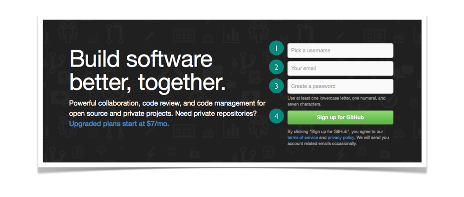
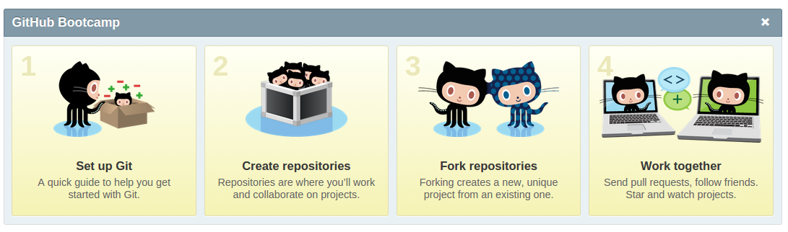
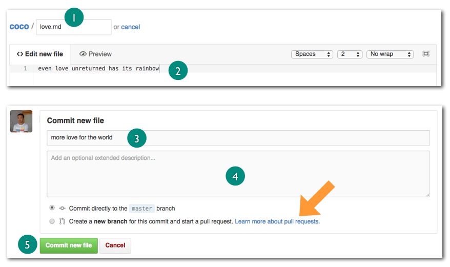
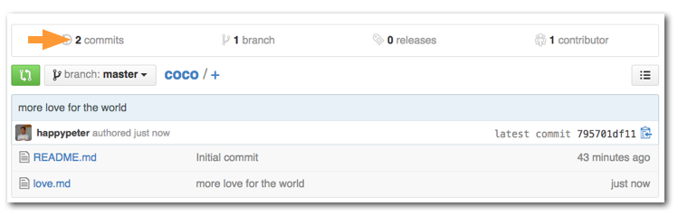
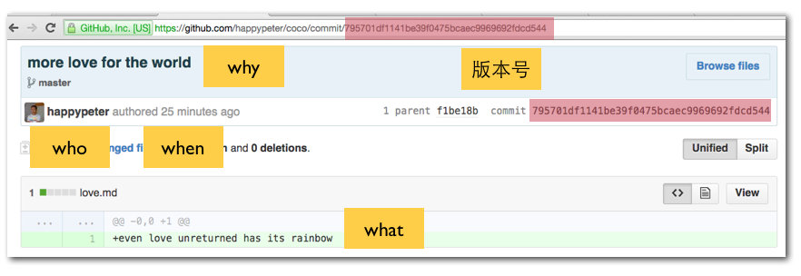
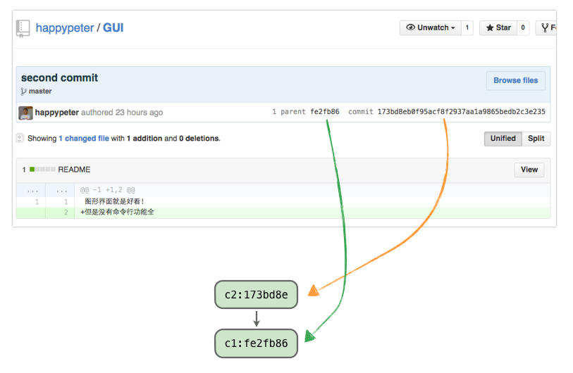
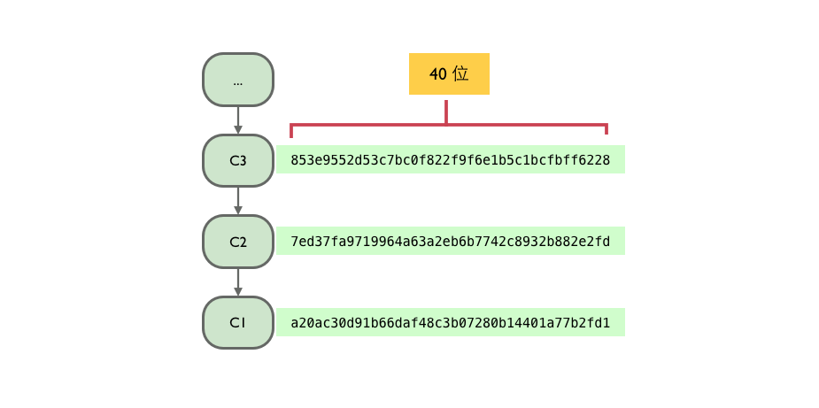

<!-- 还要多截图，很好看：http://happypeter.github.io/gitbeijing/github_in_browser.html -->

今天 Peter 来带你做一件曾经改变我生活的事情，就是注册并使用 github.com 。不会用 git ，就不能用 github 吗? 不是这样的。Github 的网站上通过网页操作就已经能实现很多强大的版本控制功能了，来一起看一看。

### 故事从注册开始

来到 <http://github.com> 的首页，就可以看到下面的注册界面：

填写自己的用户名邮箱，再设置一个妥妥的密码，点击 `Sign up for Github` 按钮，世界就属于你了。对于开源项目 github 是免费的，所以不用管付费相关的内容。接下来初次注册的用户会看到一共四步的 github 使用教程。

今天主要介绍第二步，其他几步回头另行介绍。所以这个四步走，稍微看一下，关了就行了。以后可以到 <http://help.github.com> 找到这些内容。另外你可能还会看到要求新用户去验证一下邮箱地址的提示，这个简单，到邮箱之中找到验证邮件，点一下里面的链接就可以了。

最后一步来给自己添加一个头像吧，github 是一个真正的交朋友的地方，每次你发评论或者写代码都是代表一个活生生的人格。

如上图，登录后的用户都可以在1处找到”设置“的图标，一个小齿轮，点一下，默认看到的就是2处的 `Profile` （个人信息），到3处选择图片上传就可以了。

### 创建项目仓库

Github 上操作虽多，但是都是围绕一个个的项目展开的。

一个项目其实就是一个文件夹，里面放着所有的项目文件，可以是代码，也可以是任意的文档。但是在 github 这里，每一个项目都不仅仅是最新版本的代码，还保持着所有的历史版本和修改记录，当然这个后台就是通过 Git 来实现的。Github 上的项目有一个新名称，叫 ”仓库“ ( repository )。说白了，一个仓库就是一个用 git 进行了版本控制的项目。

点一下页面左上角的小猫图标，就可以到达 dashboard （控制面板），这个词本来的意思是汽车上的仪表板，日常所有的操作都在这里做。

上图左侧，图标1处，可以看到相关项目的最近更新，右侧图标2处，是我自己的项目列表。现在我要创建一个项目，要点3处这个按钮。

这就到达了新建项目的页面：

注意要勾选 `Initialize this repository with a README` ，然后创建这个项目。也会看到 `Create Repository` 按钮的上方还有两个选择框，一个是关于 `.gitignore` 的，后面会专门讲到，另一个是关于 `LICENSE` 的，选择开源授权协议。这两项如果选择了就是在项目中又多了两个文本文件，一个是 .gitignore 文件，另一个是 LICENSE 文件，暂时都不选就可以，回头需要了可以自己用编辑器新建。

### 编辑项目

创建项目完成后，就会跳转到 <https://github.com/happypeter/coco> 这个页面。这里的几乎每一个可以点的地方都会涉及到一个新概念，不用着急，后面咱们都会介绍到。先来瞄准一个最为重要的，叫 commit，如图中所指：

每次项目修改后，点击 `commit` 按钮就可以生成一个新的版本。commit 英文的基本意思是执行某个重要的事情，例如 commit suicide，自我了断。但是在 git 这里，做动词讲的时候是保存版本，当名词讲就是版本。

现在就来编辑一下。点击上面图中，项目名 `coco` 右侧的加号，进入下面界面。

来新建一个文件叫 love.md，在标号1处。填写文件内容，标号2处。下面 `Commit new file` 部分填写的是“版本留言”（ commit message ），说明一下为什么要做这次修改，一个以方便是方便跟队友做项目沟通，另一方面如果项目版本多了，自己也可以用这个留言来定位特定的一次修改。标号3处填写一个一行的留言，标号4处可以写详细留言，这一项是可选的。
最后，点击 `Commit new file` 按钮，一个新版本就做好了。

顺便提一下，github 的页面编辑器是经过特殊强化的，用起来非常舒服。点下图1处，可以进入全屏模式，编辑后还可以用2处的 `Preview changes` 预览一下修改内容。

自动跳转回项目页面之后，会发现原来 `1 commit` 的地方，现在已经变成了下图所示的 `2 commits`

`2 commits` 是个链接，点进入就进入了项目历史的页面。

现在看到历史上有两个版本，点开上面的一个版本，或者说一个 commit，就可以看到一个 commit 所包含的信息了。

最重要的是 `版本号` （ commit id ）。每个 commit 都有一个，是一个40位16进制数，可以用来定位每个版本。注意一下地址栏中 url 的格式，以后只要是拿到了一个版本好，就可以照猫画虎的敲上面这样的链接来查看这次的修改的详细内容了，方便吧？！

一个 commit （版本）中最核心的内容就是这4个 `w` 了，谁（ who ）在什么时间（ when ）改了那些内容（ what ），最后一个是为什么要改（ why ），这个是版本留言发挥的作用。

### 一条历史线

所有 commit（版本) 组成了一条历史线。那么这条线是怎么串起来的呢？随便打开一个项目，打开具体一个 commit，通常会看到下图的内容：

上面显示了当前版本号（ commit id ），但是同时还显示了它之前的一个 commit 的版本号，也就是它的“父版本”（ parent ） 的版本号。底层原理是这样，一个 commit 内部是保存了它的 parent 的版本号的，这样就把它和它爹连在了一起，爹还有自己的爹，就会形成下图的一条历史线。

有些版本工具是以 1，2，3... 作为版本号的，但是 git 这里每个版本号都是40位十六进制数，表面看起来稍微麻烦一些，但是实际上妙用无穷。

### 总结

Github 的功能还有很多，暂时只是介绍了最为核心的版本控制功能的一部分，后面对其他重要的功能还会有详细的介绍。
