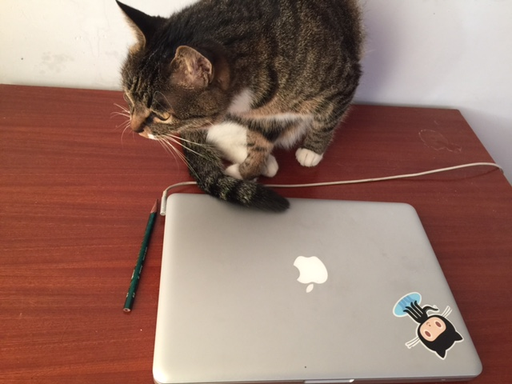

这是一本带初学者学会使用 git 版本控制工具和 github.com 社交化编程平台的书。用爱打造。你好，我是 Peter，今天是咱们见面的第一天，我想跟你聊的是一些故事和一些关于 git 北京学习安排的一些想法。

### 我和 git 的罗曼史

git 和 github 两个词初学者经常搞不清谁是谁？Git 是一个版本控制工具，是一个可以安装在你自己机器上的软件。Git 这个单词的中文意思是傻x。关于软件为何以 git 命令，git 的作者 Linus Torvalds 曾经这样调侃：

> “I’m an egotistical bastard, and I name all my projects after myself.
First Linux, now git.” – Linus

不过，也有人认为 Git 是 Global Information Tracker 的缩写形式，我认为这个说法非常能说明 git 的用途，就是对一个文件夹中的所有数据信息做跟踪，通过记录版本的形式来对内容的变化做记录。

你可以也知道，Linus 也是 Linux 操作系统之父。那时候我正在北京念书，搞 Linux，所以应该是 2007 年的时候就知道了 git，那时候 github 还没有诞生。

上面这张图片是 Linus 先生在 google 介绍 git 。这个我下载到自己的手持设备上，听了有100遍。 [可以在这里找到视频](http://git-scm.com/doc/ext) 。

Git 的魅力在于开源，在于人本和去中心化，2008 年 github 的诞生把这些价值更好的进行了推广。

Github 首先是一个公司，github.com 网站是他们的产品，提供 git 仓库的托管服务。我是2009年开始用 github 的，那时候我还是 c/c++ 程序员，但是发现太喜欢 github 公司的文化和他们的那些工具了，而这些人都是来自 ruby 社区，这些工具都是 ruby 语言开发的，所以我就逐渐学习了 Ruby，也正是因为 ruby 我理解了 Web 开发，理解了互联网的开放和自由，所以很快就成了全职的网站开发者。

Git 和 Github 改变了我的职业，直到今天6年过去了，依然感觉是如此的幸运。

### git 和 github 如何改变生活

学了 git 会发财吗？会！

- 备份
- 推送部署
- 个人简历，通过项目带来人气
- 交友平台
- 项目协作 TLCL 等
- 展示分享，peter-vim 
- 创业文化，工作方式
  - - 整个流程中体现了对开发者的尊重，真正像一个创作者一样对待他们，而不是当打杂的。
  -   - 但是可以提一下，zachholman.com 很值得一看
- 参考项目多多，改变了开发流程，开源的威力

### 本书内容

git 是一个很大的话题，《Git 北京》这本书围绕这几个核心来组织内容：

- 面向初学者。 一个反例就是 [Progit](http://git-scm.com/book/en/v2) 这本书，质量虽然高，但是内容比较全面深入，所以不适合初学者
- 结合实际应用情形。很多时候演示要比讲解好一千倍。我觉得，技术如果脱离开实际应用场景来讲，就会很空洞枯燥。每一天 Peter 会跟你一起完成一些 git 相关的任务，过程中如果需要介绍理论了，就会穿插进来讲。
- 深入讲解最重要的点。本书并不只是一本快速上手的教程。对于不懂会直接影响日常使用那一部分知识点，会做比 Progit 更为详细的讲解。

这是一本给普通开发者的书（不是培养 git 专家），所以我会从日常开发工作的实际图景把握各个知识点的轻重，让大家花20%的时间掌握80%最常用的操作。