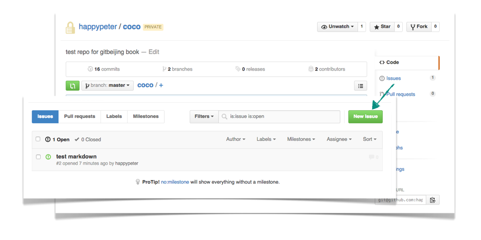
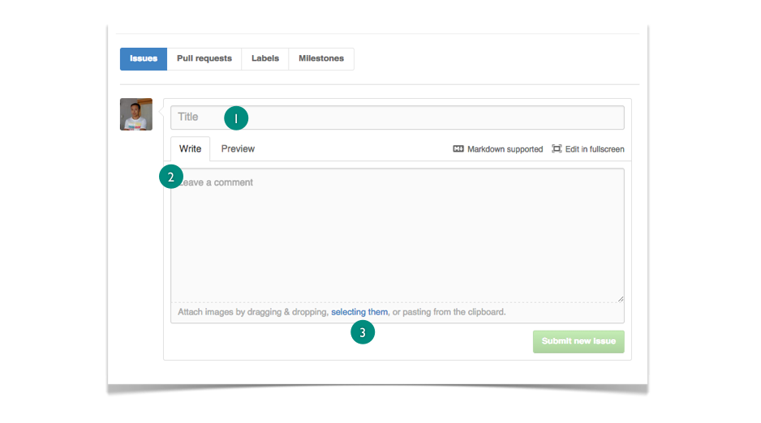
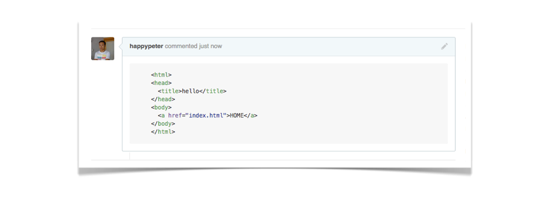

Github 上的每个项目仓库，都有三套基础设置可供使用：一个是通过 Github Pages 机制建立项目网站，后面会介绍的。另外一个就是每个项目都可以开自己的 wiki ，作为项目的知识库存。第三个就是咱们今天的主角，事务卡片（ Issues ）。很多比较复杂的项目管理软件会把“报 Bug ”，“提新需求”，“其他讨论”，这些项目相关的内容分成不同的板块来进行，在 Github 这里，所有的内容就都作为事务卡片来统一管理了。


<!-- 对于很多英文不好的同学，即使写明的内容也是坑，例如上传图片。我还是细心的介绍一下吧，给出英文的解释 -->

### 基本使用
比较详细的 Issues 功能介绍，可以参考[官方的 Issue 指南](https://guides.github.com/features/issues/)，今天咱们这里会捡着一些重要的来说。在 [How Github Use Github To Build Github](http://gitbeijing.com/talk/how-github-use-github-to-build-github/) 这个演讲中又 Issues 的使用哲学的一些讨论，都是非常有启发性的。

到项目主页，例如 http://github.com/happypeter/coco 页面上，如何来提一个 Issue 呢？



上面图中，点击项目主页右侧的 `Issues` 链接，打开的页面中的大大的绿按钮就是新建 Issue 按钮，点一下就可以看到下图所示的界面



如上图所示，是一个简单到不能再简单的页面，但是很多时候简单的确意味着更加的灵活和强大。1处添加标题，2处详细描述一下，要加图片？点一下3处的链接就行了。

另外，对于开源项目，任何人都有权利提 Issue 的，有时候我有问题需要跟项目拥有者沟通，就可以提一个 Issue 。

### 支持 Markdown 语法

在新建 Issue 的界面上可以看到 `Markdown Supported` （支持 Markdown）的链接，点开，可以看到一篇详细的 Markdown 介绍文档。 


Markdown 是一种标记性语法，可以方便的写出格式美观的文档。下面来演示一下它的主要几个功能。

例如，可以像下面这样在你的 Markdown 文件里为 Ruby 代码添加语法高亮：


    ```html
    <!DOCTYPE html>
    <html>
    <head>
      <title>hello</title>
    </head>
    <body>
      <a href="index.html">HOME</a>
    </body>
    </html>
    ```

效果如下：



### 小技巧

还有几个小技巧也非常的能提高工作效率。

第一个，快速引用。Issue 这里是没有 reply 按钮的，如果你想回答具体某个问题，可以用鼠标选中那段话，然后，敲 r 。
这样这段话就自动出现在你的评论框中了。


第二个，拉别人进来讨论。如果你在评论框中输入 `@happypeter` 那么不管我是不是你当然项目的参与者，我都会收到通知来进来参加讨论。实际中发现这个用的是非常的多。


- v2 的 progit 对 github 的讲解是非常详细的，甚至包括了 markdown 在 issue 中怎么写
  - http://git-scm.com/book/en/v2/GitHub-Contributing-to-a-Project


https://guides.github.com/features/issues/


http://www.worldhello.net/gotgithub/04-work-with-others/050-issue.html#issue


- 讨论中添加 patch

- 自动指向其他 issue


### 总结
前面咱们用过很多 Pull Request 的功能了，其实一个 PR 和一个 Issue 在很多方面都是一样的，所以 Issue 这里介绍的大部分功能都可以在 PR 讨论中使用。另外，Issue 中一般是放一些临时性的讨论，最终是要被关掉的，如果能够总结出一些精华的内容，可以放到 wiki 中。