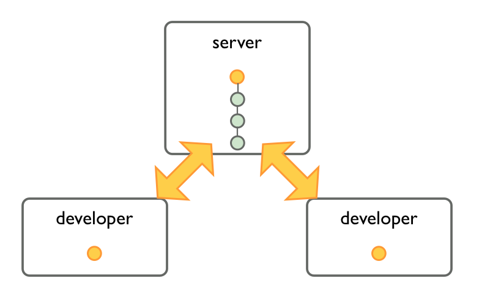
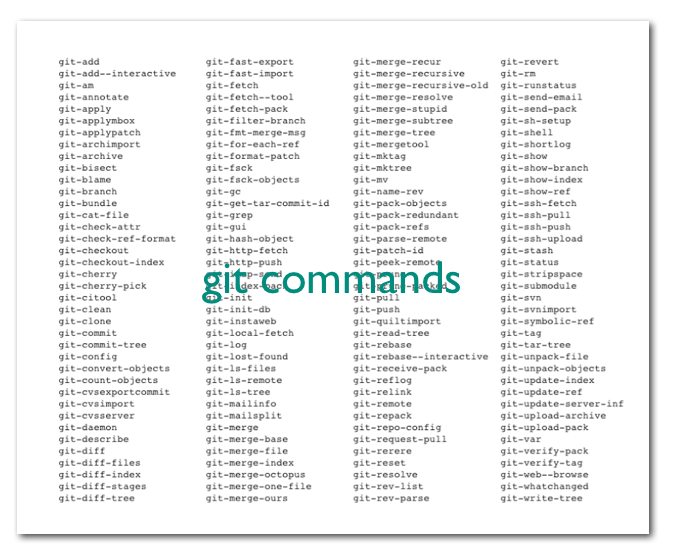
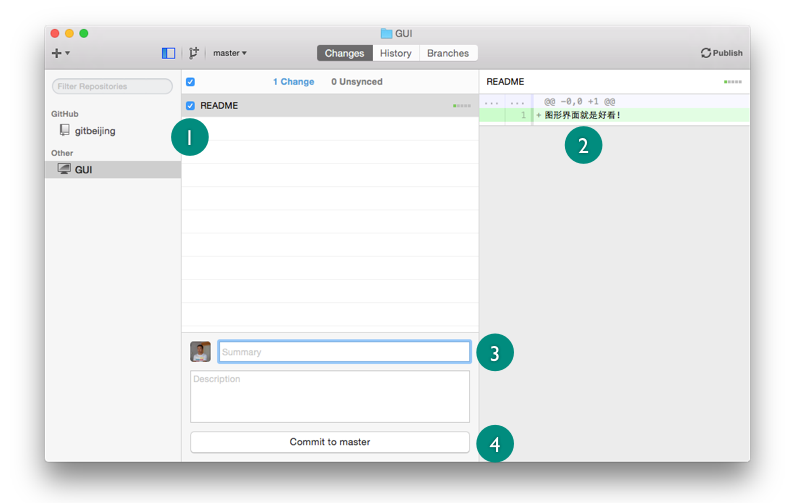
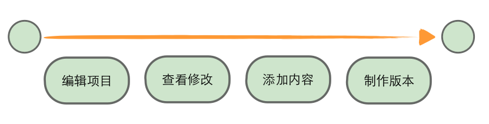
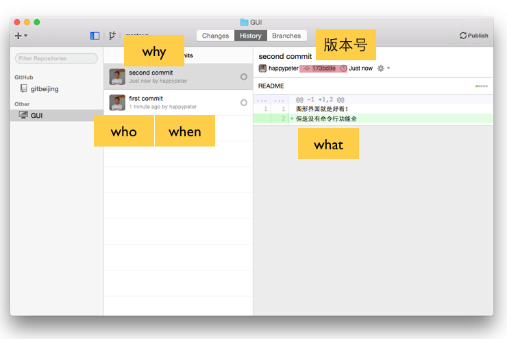

没有安装 git 并不妨碍我使用 github 的基本功能，同样，即使我不能联网，没有 github 账户，也可以在本地进行 git 的版本控制操作。
本课来把前面在 github 上实现的那些版本控制操作在本地重新来一遍。会有很多新的秘密浮出水面。

### Git 是分布式的

分布式，英文叫做 Distributed 。这个是个能够改变世界的概念，下面这张图是 Linus 在 google 讲 git 的时候的幻灯片，聊了一下集中式的问题

远的就不扯了，说说在版本控制这里，分布式和集中式（英文叫 Centralized）的区别。

git 是分布式的版本管理工具，意思是每一个 git 控制的项目仓库中都保留整个项目的历史，各个仓库是对等关系。

不像 svn/cvs 那些是中心式的工具。只有服务器上的项目才有整个历史，每个开发者本地都只是最新的版本。每次开发者要保存新版本，或者查看改版历史，都需要连接服务器。

分布式的架构优势是非常明显的，比如大部分的操作都不需要联网，速度会比集中式的快几个数量级。这个分布式的图，麻烦你一定要记在脑子里，这样后面很多 git 的特性就都可以理解了。

### 在自己的机器上使用 git

来到 [git 官网的首页](http://git-scm.com/) 就可以下载适合自己操作系统平台的 git 安装包了。git 是一个命令行工具，或者说是一套工具箱，有下图所示的这些命令：

好消息是，最长用的只不过是其中很小的一部分。git 的其他概括是：一个傻瓜式的内容管理系统，一个文件夹历史存储系统，这些都是很准确的说法。

Peter 平时主要是用命令行，但是我觉得初学者如果用一下图形化的客户端工具 [Github for Mac](https://mac.github.com/index.html) ，来掌握 git 的基本操作也是很好的，简单而直观。

windows 用户也有类似的客户端可以下载，[Github for Windows](https://windows.github.com/)。图形化工具中只提供常见操作，真正灵活使用 git 还是要用命令行的。如果你对命令行使用还不熟悉可以看看我以前录的[这门课程](http://happypeter.github.io/LGCB/) 。

git 本身，也就是命令行中的 git，和 github for mac 客户端的安装都很简单，不说了。要说的是，单独使用二者之一就可以完成下面咱们一起要做的这些操作。不过咱们这样，同样的操作，先用客户端做一遍，然后再用命令行做一遍。这样对比一下，相信会很有意思。同时咱也对比一下前面 github 上操作的那些内容啊，记住，都是一样的。

第一步，新建一个仓库。先用客户端来做。

点击上图箭头所指的 `+` 号，选择 create 这一项。填写项目名，这里就叫 GUI 吧，然后选择项目存放位置，然后 Create Repository 那个按钮点一下，仓库就创建好了。这个操作似曾相识，是吧，只不过这次是在本地机器上创建的。仔细研究一下这一步干了什么，打开命令行，执行


$ cd ~/repo_farm/GUI
$ ls -a
.      ..     .git


上面 ls 命令后面加 `-a` 可以显示隐藏文件或者文件夹。可以看到 GUI 文件夹下面什么都没有，只有一个隐藏的文件夹（或者延续 Unix 的传统叫”目录“）叫做 .git 。这个 .git 不要小看，因为未来所有的版本历史都是存放在这个文件夹中。这样说把，一个普通项目文件夹和一个被 git 做版本控制的文件夹，差别就在于有没有这个文件夹。.git 文件夹可以叫做 git 仓库的心脏。

上面用客户端完成的这个操作叫做仓库的初始化，同样的操作用命令行咱们做呢？为了区分一下，命令行下面创建的这个项目叫 CLI 吧


$ cd ~/repo_farm
$ mkdir CLI
$ git init
Initialized empty Git repository in /Users/peter/repo_farm/CLI/.git/
$ ls -a
.      ..     .git


用 `ls -a` 查看一下，跟前面一样，心脏也有了。

第二步，编辑项目。这个就用自己最喜欢的编辑器，我用 sublime，打开 GUI 和 CLI 两个项目，分别创建一个 README 文件吧，里面随便写点内容就行。这个就不演示了，如果这个都不会，你也就没必要看这本 git 书了。

第三步，commit。也就是真正生成一个版本了，这个就关键了。

先用客户端来做。GUI 项目中有了 README 文件后，到项目的 `changes` 一项下面，就可以看到：

首先图中1和2两处可以看到目前项目修改了什么内容。这个在命令行中怎么看呢


$ cd CLI/
$ git status
... README ...
nothing added to commit but untracked files present (use "git add" to track)


输出信息中就可以看到哪些文件被修改了。 同时说 README 这个文件没有被 git 跟踪。执行


$ git add README


这一句就是通知 git，哪些修改内容需要被做到下一个版本之中去。`git add` 命令会把文件添加到 git 的“暂存区”（ staging area ），所谓的“被跟踪”（ tracked ）就是添加到了暂存区。

想象一下如果修改多个文件，可以有选择的来把一部分内容做到下一个 commit 中去。这个相当于上面客户端图里面的勾选 README 这一步。如果对已经跟踪的文件做了修改，可以通过 `git diff` 命令来查看这些改动。

接下来就可以到图示中3和4的地方填写再版留言并且执行 commit 来作出版本了。同样的，这个用命令行怎么做呢


$ cd CLI/
$ git commit -m "add README"


这里会报错，说没有设置 name 和 email 信息，好解决，就是运行下面两条命令：


$ git config --global user.name "Peter Wang"
$ git config --global user.email "happypeter1983@gmail.com"


相当于自己手写这些内容到 ~/.gitconfig 文件中


[user]
  name = Peter Wang
  email = happypeter1983@gmail.com


可以看到命令行其实就跟说话一样，`git` 啊，你把当前添加的内容给 `commit` 了吧，`-m` 就是 message 的缩写呗，这个后面的就是再版留言啊。好这样一个 commit 就做完了。过程中选择哪些内容需要做到下一个版本中，哪些不需要的这个操作在 github 网页上是实现不了的。

所以总结起来，从一个 commit 到下一个 commit，也就是从历史上的一个节点到下一个节点，要经历的操作是下面四步：

所以再分别到 GUI 和 CLI 两个项目中重复一下上面的四步。这样到客户端的 history 一项下面，就可以看到历史线上已经有两个 commit 了，点开任意一个都可以看到4个w。版本号没有例外的都是40位，但是真正要用的时候取前几位就行，只要跟其他 commit 区分开就行，图中给出了前7位，已经是非常安全了。即使在一个超大型项目，历史成千上万，版本号冲突的概率也比被雷劈中两次要低很多了。

那在命令行中如何查看历史信息呢？可以用

    cd CLI/
    git log -p

这样所有的版本和各种里面的4w就都出来了。但是问题是不够美观，所以实际中我会安装一个命令行中的前端工具叫 [tig](https://github.com/jonas/tig) 来进行查看。

### Peter 的实际命令行工作流

很多年前就听软件业的老人们说：刚刚够用是王道。多年来，我越来越觉得这句话有道理。所以如果你的版本控制需求很简单，那么请继续使用客户端工具。但是这里我要给出我自己实际的命令行操作步骤。

做修改后，查看修改的文件就用

    git st

`st` 是 status 的别名，是我在我的 ~/.gitconfig 文件中设置的，我的 .gitconfig 文件内容如下


[user]
  name = Peter Wang
  email = happypeter1983@gmail.com
[core]
  editor = vim
[alias]
  ci = commit -a -v
  st = status
  br = branch
  throw = reset --hard HEAD
  throwh = reset --hard HEAD^


修改的内容，其实包括下面几种情况：
1. 增加新文件，应该用 git add filename 进行跟踪
2. 删除新文件，用 git rm filename
3. 移动或重命名文件，用 git mv 命令

但是我的实际操作是这样，如果有了上面这几种情况，那就运行


$ git add -A


来跟踪所有修改。可以通过 `man git-add` 来查看 `-A` 参数的意义。但是如果项目中有一些文件就是我根本不想跟踪版本，更不想 push 到 github.com 上让被人看到的，这样就可以来把这些文件放到 .gitignore 文件中。例如在一个典型的 Rails 项目中，会有类似这样的 [.gitignore](https://github.com/happypeter/happycasts/blob/master/.gitignore) 。

但是，如果只是对已经跟踪的文件里面的内容进行了修改，那就运行 `git commit -a ...` 这样的命令就可以了，`-a` 参数会添加修改到下一个版本中的。
但是命令很长，所以我在 .gitconfig 中设置了别名 `ci` ，同时注意下面的 `editor = vim` 的设置。这样每次我执行


$ git ci


就可以用 vim 编辑器打开一个页面，在这里可以敲 `i` 进入 vim 的插入模式来添加再版留言。同时注意 `ci` 别名中还有 `-v` 参数，有了它，那在我这个 vim 打开的页面下方，就可以看到这次的 patch 了。在最后要做 commit 之前的这一秒看一下要有哪些内容会做到版本中，实际中是非常能够减少误操作的。

### 总结

这里只是最基本的版本控制操作，历史回滚等其他内容后面再讲。