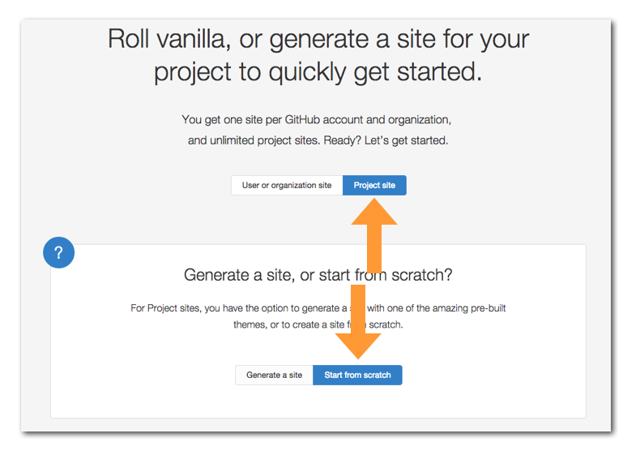
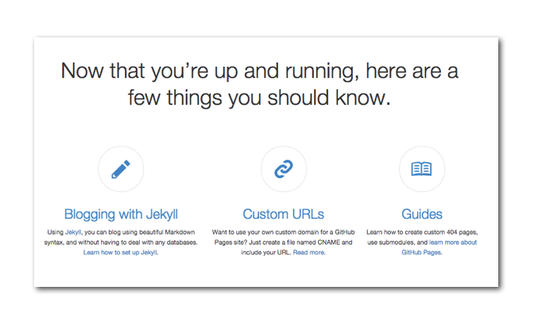

Github Pages 是 github 公司提供的免费的静态网站托管服务，用起来方便而且功能强大。在 <https://pages.github.com/> 首页上可以看到很多用 Github Pages 托管的网站，很漂亮。

### 你甚至不用会 git

到 <https://pages.github.com/> 上，可以看到可以创建的网站有两类，一类是为自己或者是自己的组织创建站点，这个比较简单，就是新建一个仓库，仓库的名字叫做，username.github.io 或者是 orgnizationname.github.io ，注意这里的 username 和 orgnizationname 要严格替换成你自己的用户名或者组织名，不然就会有问题。然后就往仓库里面放内容就行了。第二类是为项目创建网站，这个其实主要步骤都是一样的，只不过网站的存放位置不一样，是在这个项目仓库里，新建一个分支 gh-pages，然后来添加网站内容。

下面咱俩一块动手来建一个项目网站，如下图这样

在 <https://pages.github.com/> 选择 `Project Site` 然后下面有两项，一个是用自动生成器自动生成一个漂亮的网站，咱们选另一个方案，自己手写，因为这个方案比较能展示清楚本质。

一路沿着文档给出的步骤坐下来，网站就有了。

### 日常的流程是这样
不过上面的步骤只是适合很简单的网站，日常中真正做一个项目网站基本上是这样的流程。

github.com 上这个仓库先 clone 到本地，然后跳转到 gh-pages 分支


$ git clone git@github.com:happypeter/CLI.git
$ cd CLI
$ git checkout gh-pages


每次在本地用自己喜欢的编辑器做一下修改，commit 并 push，修改就上线了。整个过程实现了版本控制，数据备份，同时最最让人心醉的是 push 即是部署，还有比这更方便的吗？

在创建 Github Pages 这个机制的时候，作者 Tom 写过一篇文章，[blogging-like-a-hacke](http://tom.preston-werner.com/2008/11/17/blogging-like-a-hacker.html) 其中谈到了一些设计要点：

>First, all my writing would be stored in a Git repository. This would ensure that I could try out different ideas and explore a variety of posts all from the comfort of my preferred editor and the command line. I’d be able to publish a post via a simple deploy script or post-commit hook. Complexity would be kept to an absolute minimum, so a static site would be preferable to a dynamic site that required ongoing maintenance. My blog would need to be easily customizable; coming from a graphic design background means I’ll always be tweaking the site’s appearance and layout.

就像 Tom 上面说的，每次我自己看到网站的样式有需要改的地方，很容易就可以改好然后 push 上去就生效了。

好，不管是用网页还是命令行来操作，上面这些还只是展示了，Github Pages 的托管静态页面的功能，但是其实故事并不停在这个地方。在 <https://pages.github.com/> 的最低端还可以看到下面三个事情：

下面分别来介绍一下。

### jekyll

> Over the last month I’ve brought these concepts to fruition and I’m pleased to announce Jekyll. Jekyll is a simple, blog aware, static site generator. 

### 自己的域名

http://coldbutsweet.com/

有一个功能其实很重要就是绑定自己的域名。想想如果有天 github 网站被依法和谐了，那怎么办？如果一开始就是用自己的域名，那就简单了，直接换一台服务器就好了。

具体的操作步骤在 [here](https://help.github.com/articles/setting-up-a-custom-domain-with-github-pages/) 。

### 总结
  上面就是 github pages 的基本操作，其实 github pages 后台还有 jekyll 框架的支持，所以还是很灵活和方便的，但是 jekyll 本身的应用跟 git 没有什么关系。所以不是本书中要介绍了，我录了一个 happycasts 视频，有空你可以看看。