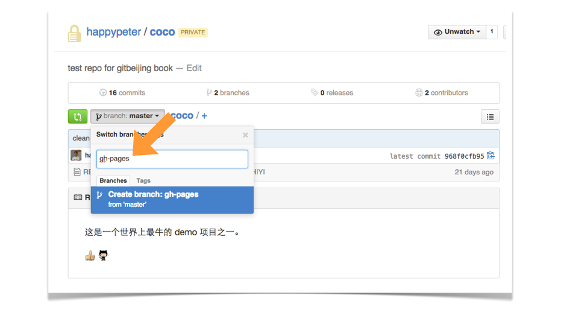
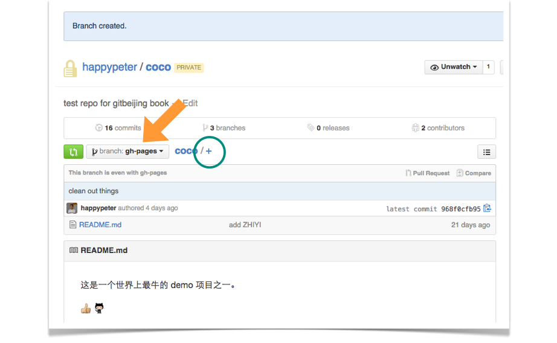
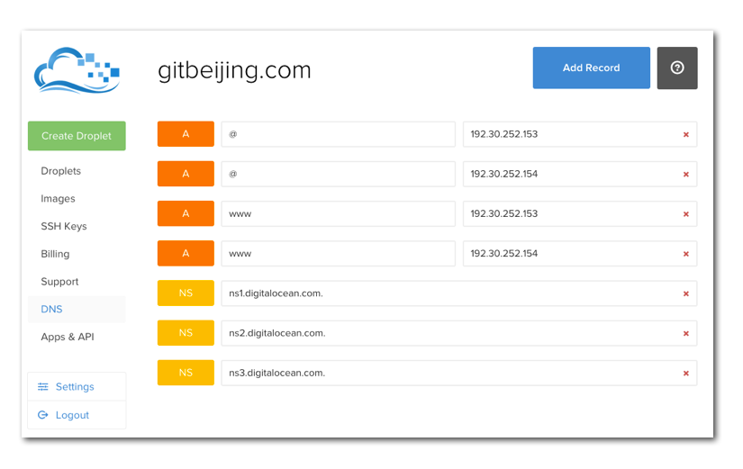

Github Pages 是 github 公司提供的免费的静态网站托管服务，用起来方便而且功能强大，不仅没有空间限制，还可以绑定自己的域名。在 <https://pages.github.com/> 首页上可以看到很多用 Github Pages 托管的网站，很漂亮。另外很多非常著名的公司和项目也都用这种方式来搭建网站，如[微软](http://microsoft.github.io/)和 [twitter](http://twitter.github.io/) 的网站，还有 [谷歌的 Material Design 图标](http://google.github.io/material-design-icons/) 网站。

### 分类和文档

到 <https://pages.github.com/> 上，看到可以创建的网站有两类，一类是为自己或者是自己的组织创建站点，就是新建一个仓库，仓库的名字叫做，username.github.io 或者是 orgnizationname.github.io ，注意这里的 username 和 orgnizationname 要严格替换成你自己的用户名或者组织名，大小写也要区分，不然就会有问题。然后就往仓库里面放页面内容就行了。第二类是为项目创建网站，这个其实主要步骤都是一样的，只不过稍微比创建用户或组织网站复杂一点点，下面就以它为例来演示。

建一个项目网站的详细步骤在 <https://pages.github.com/> 页面上是有的，如下图

选择 `Project Site` 然后下面有两项，一个是用自动生成器自动生成（ Generate a site ）一个漂亮的网站，另一个方案是自己手写，咱们选后者，因为这个方案比较能展示清楚整个 Github Pages 的使用原理。

一路沿着文档给出的步骤坐下来，网站就有了。下面实际来动手弄弄。

### 制作过程

首先来到项目首页，例如 https://github.com/happypeter/coco 。

上图中，点 `master` 按钮，弹出的输入框中输入 `gh-pages` ，注意拼写和大小写都不要写错。然后回车，就可以创建出新分支 gh-pages 了。如下图

上图中看到，现在项目以及切换到了 gh-pages 分支，如大箭头所指。虽然 coco 项目不是开源的，但是我们放到 gh-pages 分支上的内容是会被公开成网页的，这个要注意。点击大圆圈中的加号，来添加第一个文件。

名字一定要叫 index.html ，里面的内容就随便写了。保存之后，过几分钟就可以到 username.github.io/project 这个链接中看到页面了，对于这类的情况就是 http://happypeter.github.io/coco/ 这个链接就是网站的公网 url 了。后面可以继续添加 HTML，CSS 和 JS 进来，丰富网站功能。

上面这些还只是展示了 Github Pages 的托管静态页面的功能，但是其实故事并不停在这个地方。在 <https://pages.github.com/> 的最低端还可以看到下面三个事情：

最后一项“指南”大家可以用来参考。下面分别来介绍一下 Jekyll 和绑定自己域名的功能。

### jekyll

> Jekyll 是一个简单的，支持博客结构的，静态网站生成器。

上面这段话是 Jekyll 之父 Tom 在一篇文章叫做 [blogging-like-a-hacker](http://tom.preston-werner.com/2008/11/17/blogging-like-a-hacker.html) 中说的。

Jeklly 的具体使用本身跟 git 没有直接联系，所以这里就不细说了。它主要能完成的功能有下面几项：

1. 页面不用 html 来写了，而用更为简单的 markdown 格式来写
2. 可以使用布局文件和片段文件
3. 代码高亮支持
4. 可以使用变量

详细内容参考 [jekyll 官网](http://jekyllrb.com/) 。 我也录了一期详细的 Jekyll 使用视频，放在我的[好多视频](http://haoduoshipin.com/episodes/113)网站上。

### 绑定自己的域名

有一个功能其实很重要就是绑定自己的域名。想想如果有天 github 网站被依法和谐了，那怎么办？如果一开始就是用自己的域名，那就简单了，直接换一台服务器就好了。

具体的操作步骤在 [here](https://help.github.com/articles/setting-up-a-custom-domain-with-github-pages/) 。

[Configuring a www subdomain](https://help.github.com/articles/tips-for-configuring-a-cname-record-with-your-dns-provider/#configuring-a-www-subdomain)

首先在 godaddy.com 上，让 gitbeijing.com 使用 digitalocean 的 domain server : ns1.digitalocean.com

下一步，到 digitalocean 网站上，添加 A Record 指向 192.30.252.153 和 192.30.252.154

对于 gitbeijing 我是在 digitalocean 网站上最终设置成了这样。

插一句，以前我还设置过一个 coldbutsweet.com 是在万网 net.cn 上设置的，下面是截图

最后，当然是要到项目 gh-pages 分支，创建 CNAME 文件，里面的内容是


gitbeijing.com


<!--  you will need to create A records that point to 192.30.252.153 and 192.30.252.154
https://help.github.com/articles/my-custom-domain-isn-t-working/
 -->

晚上做完上面的操作，第二天早上访问 <http://gitbeijing.com> 已经可以访问到我的网站了，如果访问 <http://www.gitbeijing.com> 则可以跳转到 <http://gitbeijing.com> ，效果完美。

### 总结
喜欢分享是一个好程序员的标志，我给我的很多初学编程的朋友的建议就是，先学习如何用 Github Pages 搭建自己的个人网站，一来可以锻炼一些基本的网站开发技巧，二来可以建立一个分享的阵地。
