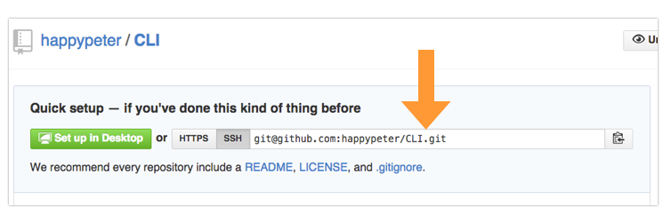
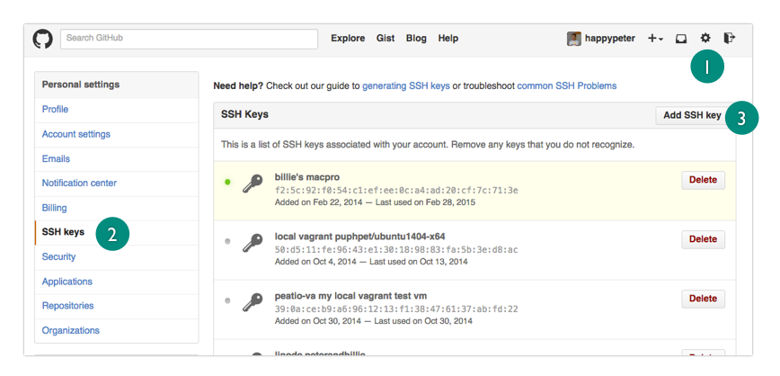
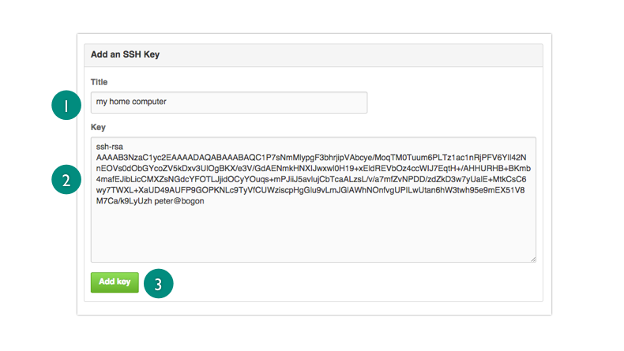
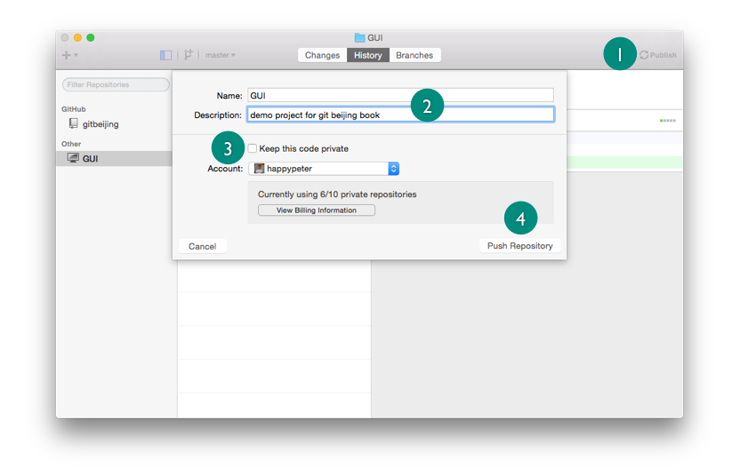
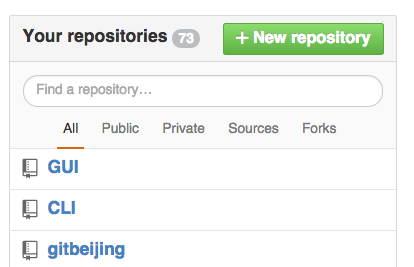

通常情况下，我的每一个本地的 git 仓库都是托管在 github 上的。也就是本地机器和服务器是能够通气的，这集看看怎么通。这样，我既可以在本地用自己喜欢的编辑器和命令行来做项目开发，同时相同的内容又都很方便的备份到了 github 网站之上，一方面是安全，一方面又有利于和他人展开项目协作，一举多得。

### 上传本地项目到 github

打个比方，我有一些货要送到云南，那我首先要在云南那边开个仓库吧，然后拿到这个仓库的地址后，北京这边的货才能发车。

所以先到 github.com 网站上新建一个项目，名字就叫 CLI，注意这次千万要保证这个新建的仓库是空的，也就是不要勾选 ”Initialize this repository with a README“ 这一项。创建成功就看到了下面的地址，这个就是咱们要的仓库地址了。

来到命令行


$ cd CLI/
$ git remote add origin git@github.com:happypeter/CLI.git


这一步就是添加了仓库地址到本地的 .git 目录里面，具体来说就是 .git/config 文件中又多了这门几行

    [remote "origin"]
        url = git@github.com:happypeter/CLI.git

这里 `origin` 是这个地址的代号，因为未来可能添加多个远端地址。

添加好之后下一步真正要把数据传输到 github.com 上就要运行

    git push -u origin master

由于这个命令非常重要，所以来详细解释一下，这里执行的命令是 git-push 可以通过 `man git-push` 来查看这个命令的手册，里面也能找到 `-u` 参数的意义。简单来说，`push` 就是要把本地数据”推送“到 github 服务器上。`origin` 就是地址的代号，`master` 是分支的名字。一个仓库是可以有多个分支的，后面会有专门的内容讲解分支。分支的意义明确之前 `-u` 参数不太好理解，暂时就记住，这个参数的作用是在本地仓库的当前分支，其实就是本地的 master 分支，和服务器的仓库，也就是 origin 对应的仓库，的 master 分支之间建议一种绑定关系，因为实际项目中本地和远端都有多个分支，没有绑定关系，那么未来向远端 push 数据，或者从远端 pull 数据的时候就乱套了。`-u` 参数只需要在首次 push 的时候添加一次就可以了。后续执行相同的推送数据操作，只需要 `git push` 不加参数就可以了。

理论上就是这样了，但是实际执行，会报错：

    Permission denied (publickey).

这里的问题是这样，github.com 是个互联网的服务器，安全问题当然要考虑。所以如果我想 push 内容到 github 首先需要证实自己的身份，用一种方式表明我确实是 github 上注册的那个 happypeter 用户。这种验明正身的方式并不唯一，比如刚才如果添加的 remote 地址是以 https 打头的那个，那就需要每次 push 的输入用户名和密码。这样倒是可以达成目的，但是不方便。更好的一种方法是添加 ssh key 。

### 添加 ssh key

添加 ssh key 的目的是要在服务器和客户机之间达成互信，谁是服务器？Github.com 谁是客户机？我自己的笔记本。

到 <https://help.github.com/> 搜一下 ”ssh“ 可以找到 [这篇文档](https://help.github.com/enterprise/2.1/user/articles/generating-ssh-keys/)，里面详细介绍了添加 ssh key 的方法。但是 Peter 自己用的是下面的简化一点的步骤，一样好用哦，我用了6年了。

先把系统上原有的 ssh key 备份或者删除：

    cd # 跳转到自己的用户主目录
    rm -r .ssh

来生成一对 ssh key
  
    ssh-keygen

回车执行之后会有三个地方停下来问我是否要设置一些信息，全部都回车略过就行。这样就在 ~/.ssh 文件夹下生成了一对 ssh key 。
id_rsa 这个文件中保存的是 private key 私钥，这个要严格保密。id_rsa.pub 中是 public key，这个是要上传到 github 上的。

下面的思路就很简单了，就是拷贝粘贴。先用自己喜欢的编辑器打开 id_rsa.pub 文件，鼠标选中里面的内容，注意这就是一个一行的字符串，拷贝时候最后的位置千万不要多拷贝一个空格或者回车。Ctrl-C 放到剪切板中。

到 github.com 上，点击页顶导航栏的设置图标，也就是上图中1位置，就可以看到下图的界面。选中2处的 ssh keys 这一项，点击3处的 Add ssh key 按钮。这样就看到下图的输入框了。

1处的 Title 就是备忘用的，随便填什么都行。下面填写的内容注意要直接 Ctrl-V 粘贴过来，末尾不要有空格或者回车哦。然后点一下 Add Key 这样 ssh key 的添加就完成了。特别提醒一下。ssh key 添加成功后，有时直接 push 还是不成功，需要等半天一天才能生效的情况以前我也是遇到过的。

稍微分析一下原理。因为刚才生成的 private key 和 public key 这哥俩是世界上再无雷同的一对数据。这样每次我向 github 请求写入数据的时候，github 就会拿 happypeter 账户中上传的 public key 跟我本地的这个 private key 进行匹配，匹配成功当然就可以信任当然这台电脑了。

好了，执行

    git push -u origin master

首次执行 push 会看到下面的信息

    ☁  CLI [master] git push -u origin master
    The authenticity of host 'github.com (192.30.252.128)' can't be established.
    RSA key fingerprint is 16:27:ac:a5:76:28:2d:36:63:1b:56:4d:eb:df:a6:48.
    Are you sure you want to continue connecting (yes/no)?

这个直接回答 yes 回车就可以。 这样，再到 <https://github.com/happypeter/CLI> 刷新一下页面，就看到数据已经上传成功了。

### 用客户端上传项目

客户端中的操作更为方便，前提是已经用自己的 github 账号在客户端登录了。这样就不需要用前面的 ssh key 的形式达成互信了。

操作就是上图这些步骤。首先，点击1处的 publish ，然后填写项目名和描述，注意3处不要勾选 keep this code private，实际上如果不是付费用户也根本没有这个权限。最后点击 Push Repository 按钮就行了。这样到 github.com 自己的 dashboard，看一下右下方的仓库列表

可以看到 GUI 这个项目已经在表的最顶端了。实际中常用的一个小贴士，列表的排列顺序是安更新时间由近到远排列的。

总之，用客户端操作，很多细节都被掩盖了，实际应用中这可能是双刃剑。

### 从服务器下载项目到本地

clone

pulll

### 总结

服务器和本地机器打通之后，后面可以玩的花样就更多了。