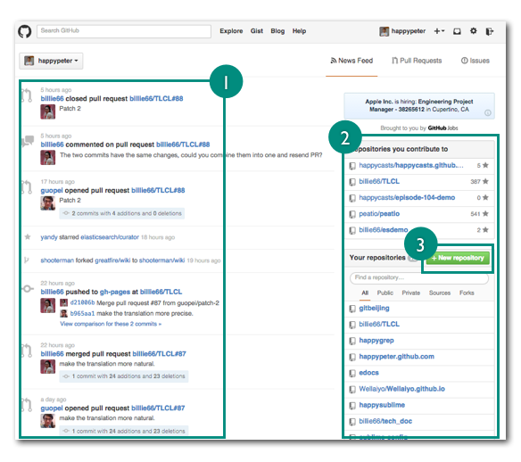
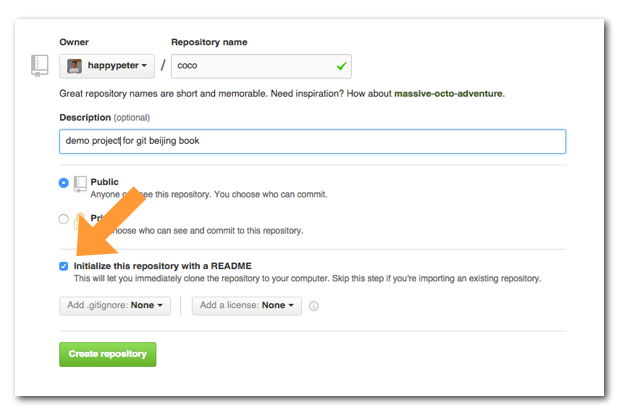
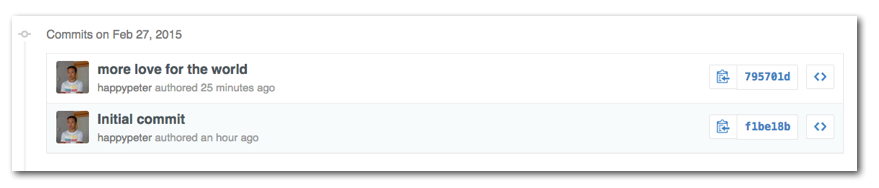

<!-- 本课介绍在网页上使用 github 来进行项目的版本控制。幻灯片中要展示清楚版本控制这个概念：什么是项目仓库 repo，版本 commit，什么是 patch，对应的这些概念在 github 网页上当然也能看得非常清楚。
 -->

不会用 git ，就不能用 github 吗? NO! Github 的网站上通过网页操作就已经能实现很多强大的功能了，来一起看一看。

### 故事从注册开始

来到 <http://github.com> 的首页，就可以看到下面的注册界面：

填写自己的用户名邮箱，再设置一个妥妥的密码，点击 "Sign up for Github" 按钮，世界就属于你了。对于开源项目 github 是免费的，所以不用管付费相关的内容。
接下来初次注册的用户会看到一共四步的 github 使用教程。

本课中就是介绍第二步步，其他几步回头另行介绍。稍微看一下，关了就行了。以后可以到 <help.github.com> 看到这些内容。另外还会看到要求我去验证一下邮箱地址，到我的邮箱之中找到验证邮件，点一下里面的链接就可以了。

最后一步给自己添加一个头像吧，github 是一个真正的交朋友的地方，没有头像怎么行！可以到 Settings->Profile 这里来添加。

### 创建项目

一个项目其实就是一个文件夹，里面放着所有的项目文件，可以是代码，也可以是任意的文档。但是在 github 这里，就有一个新名称了，叫 ”仓库“ ( repo )，一个仓库就是一个用 git 进行了版本控制的项目。

点一下页面左上角的图标，就可以到达 dashboard ，控制面板，这个词本来的意思是汽车上的仪表板，日常所有的操作都在这里做。

比如左侧，图标“1”处，可以看到相关项目的最近更新，右侧，图标“2”处，是我自己的项目列表。现在我要创建一个项目，也就是点“3”处这个按钮。

这就到达了，这个新建项目的页面：

因为咱们没有付钱注意这次要勾选 “iInitialize this repository with a README” ，然后创建这个项目。也会看到 Create Repository 按钮的上方还有两个选择框，
一个是关于 .gitignore 的，后面会专门讲到，另一个是关于 LICENSE 的，任意选一个自己喜欢开源授权协议的就行，我比较喜欢 MIT License 。这两项如果选择了就是在项目中又多了两个文本文件，一个是 .gitignore 文件，另一个是 LICENSE 文件，都不选就可以。

### 编辑项目

创建项目完成后，就会跳转到 <https://github.com/happypeter/coco> 这个页面。这里的几乎每一个可以点按的地方都会涉及到一个新概念，不用着急，后面咱们都会介绍到。这里先来瞄准一个最为重要的，叫 commit，如图中所指：

每次项目修改后，点击 "commit" 就可以生成一个新的版本。commit 这个词有时候当动词就是”记录当前的版本“，当名词时候就是[一个版本](https://www.kernel.org/pub/software/scm/git/docs/gitglossary.html) 。

现在就来编辑一下。点击上面图中，项目名 “coco” 右侧的加号，进入下面界面。

来新建一个文件叫 love.md，标号1。填写文件内容，标号2。下面 commit new file 部分填写的是“再版留言”，说明一下为什么要做这次修改。标号3处填写一个一行的留言，如果要详细描述可以到标号4处，也可以不填。
最后，点击 Commit new file 按钮，一个新版本就做好了。顺便提一下，github 的页面编辑器是经过特殊强化的，用起来非常舒服。可以进入全屏模式，编辑后还可以用 preview mode 查看一下修改内容。

自动跳转回项目页面之后，会发现原来 "1 commit" 的地方，现在已经变成了下图所示的 "2 commits"

"2 commits" 这里是个链接，点进入就进入了项目历史的页面。

现在看到历史上有两个版本，点开上面的一个版本，或者说一个 commit，就可以看到一个 commit 所包含的信息了。

最重要的是 `版本号` 或者叫 commit id 。每个 commit 都有一个，是一个40位的16进制数，可以用来定位每个版本。

核心的内容就是这4个 `w` 了：

- Who 谁
- When 什么时间
- What 做了哪些修改内容，每次修改的内容叫做一个 patch，代码补丁，这个是后面经常会用到的概念。
- Why 为什么要改，就是刚才我自己写的”再版留言“，同一个项目中可能有多个开发者在工作，所以这个留言对于项目沟通非常重要

后面再聊 git 本地操作的时候，会涉及到相同的这些元素。

### 总结
github 的功能还有很多，本节中只是介绍了最为核心的版本控制功能的一部分，后面对其他重要的功能还会有详细的介绍。
